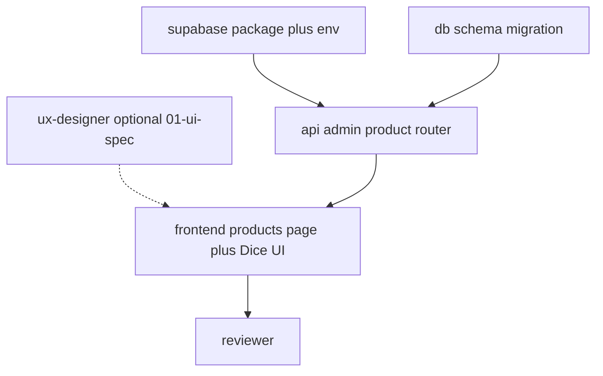

# Execution plan: Admin template products + Supabase storage (`admin-template-products`)

## 0. Workflow preflight

| Check | Status |
|--------|--------|
| `00-requirements.md` | Present in this folder |
| `02-test-spec.md` | Present (explicit **tests skipped** — see file) |
| `npx tsx src/scripts/workflows/plan.ts` | **Not in repo** — plan authored manually (same as `machines-admin`) |
| Git branch | **Create a feature branch** before implementation; avoid shipping from `main` with unrelated WIP |
| `01-ui-spec.md` | **Optional:** run **ux-designer-agent** first if you want a written UX doc; otherwise **frontend-agent** follows requirements + Dice UI patterns |

**Human checkpoint 1 (before coding):** Approve schema shape (single vs multiple images per product), bucket public vs private (affects signed read URLs), and whether **delete product** must **delete Storage object** (recommended).

**Human checkpoint 2 (before merge):** Confirm Supabase bucket policies + env vars in deployment (server + Vite client).

---

## 1. Thinking

### Invisible knowledge (for implementers)

- **Auth:** All product and upload orchestration procedures use **`adminProcedure`** from [`apps/server/src/trpc/procedures.ts`](apps/server/src/trpc/procedures.ts). Admin UI is already gated in [`apps/admin-frontend/src/routes/_admin/route.tsx`](apps/admin-frontend/src/routes/_admin/route.tsx). Never expose upload URL minting on `publicProcedure`.
- **DB:** Drizzle schemas under [`packages/db/src/schema/`](packages/db/src/schema/), re-exported from [`packages/db/src/schema/index.ts`](packages/db/src/schema/index.ts). Use **text** PKs + `crypto.randomUUID()` to match [`machines.ts`](packages/db/src/schema/machines.ts). Run `db:generate` / migrate per [`packages/db/drizzle.config.ts`](packages/db/drizzle.config.ts).
- **API surface:** Register nested router under `adminRouter` in [`apps/server/src/trpc/routers/admin.ts`](apps/server/src/trpc/routers/admin.ts); root unchanged in [`apps/server/src/trpc/router.ts`](apps/server/src/trpc/router.ts).
- **Supabase upload flow (from docs):** Server (service role) calls `storage.from(bucket).createSignedUploadUrl(path, options?)`. Client uses **anon** Supabase client `uploadToSignedUrl(path, token, file, { contentType })` — token comes from `createSignedUploadUrl` response. URLs are valid ~2 hours.
- **Path safety:** Server generates **opaque paths** (e.g. `templates/{templateProductId}/{uuid}.ext`); never trust client-supplied paths. Validate `templateProductId` exists before minting URL.
- **Future operators:** Add nullable **`organization_id`** on `template_product` (null = global template). `template_product_image` references `template_product.id` only — org scoping enforced later in procedures.
- **Env:** Extend [`packages/env/src/server.ts`](packages/env/src/server.ts) with `SUPABASE_URL`, `SUPABASE_SERVICE_ROLE_KEY`, product bucket name (e.g. `SUPABASE_STORAGE_BUCKET_PRODUCTS`). Extend [`packages/env/src/web.ts`](packages/env/src/web.ts) with `VITE_SUPABASE_URL`, `VITE_SUPABASE_ANON_KEY` for browser upload helper.
- **Monorepo package:** New **`packages/supabase`** (`@slushomat/supabase`): `createServerClient` (service role, no session persistence) + **`SupabaseStorageService`** (signed upload URL, remove objects, optional signed download for private buckets). **Server** depends on this package; **admin-frontend** may depend on `@supabase/supabase-js` only for `uploadToSignedUrl`, or use a thin re-export from `@slushomat/supabase/browser` if you want one entry point — keep bundle and secrets clear (never ship service role to Vite).
- **UI:** New route [`apps/admin-frontend/src/routes/_admin/products.tsx`](apps/admin-frontend/src/routes/_admin/products.tsx) (`/_admin/products`). Add nav in [`admin-app-sidebar.tsx`](apps/admin-frontend/src/components/admin-app-sidebar.tsx) and crumbs in [`admin-breadcrumbs.tsx`](apps/admin-frontend/src/components/admin-breadcrumbs.tsx). Install Dice UI file upload via shadcn: `npx shadcn@latest add @diceui/file-upload` (registry may require network; follow [Dice UI docs](https://www.diceui.com/docs/components/file-upload)).
- **Dashboard wording:** Product owner asked for admin area to **be** a Products-focused page — either keep `/dashboard` as-is and add **Products** to sidebar, or redirect `/dashboard` → `/products` after launch; decide at **Human checkpoint 1**.

### Layer breakdown

1. **Infra / package** — `@slushomat/supabase` + env vars + pnpm workspace wiring.
2. **Database** — `template_product`, `template_product_image` (+ optional `organization_id` on `template_product`).
3. **API** — Admin tRPC (`templateProduct`): CRUD + `requestImageUpload` + confirm image mutation (names flexible).
4. **Supabase dashboard** — Bucket, RLS/policies (service role bypasses RLS for server; document what anon needs for `uploadToSignedUrl`).
5. **Frontend** — Products page + Dice UI upload wired to tRPC + Supabase client upload.

**Tests:** None. Optional **reviewer-agent** pass only (`02-test-spec.md` records the skip).

### Dependency order



---

## 2. Execution order table

| Step | Task ID | Agent | Depends on | Parallel with |
|------|---------|--------|--------------|---------------|
| 0 | T00 | ux-designer-agent | — | T01, T02 |
| 1 | T01 | generalPurpose or storage-agent | — | T00, T02 |
| 2 | T02 | db-agent | — | T00, T01 |
| 3 | T03 | api-agent | T01, T02 | — |
| 4 | T04 | frontend-agent | T03 | — |
| 5 | T06 | reviewer-agent | T04 | — |

---

## 3. Per-task definitions (subagents)

### T00 — UX / UI spec (optional)

```
Task ID: T00
Agent: ux-designer-agent
Layer: Discovery / UX
Description: Produce 01-ui-spec.md for Products page: list + sheet/dialog for create/edit,
             image replace flow, error states (upload fail, invalid file), empty state,
             delete confirm. Clarify single-image vs gallery for MVP.
Artifact: .cursor/tickets/admin-template-products/01-ui-spec.md
Depends on: —
Risk: low
```

---

### T01 — `@slushomat/supabase` package + env

```
Task ID: T01
Agent: storage-agent (or generalPurpose if storage-agent is storage-specific to Supabase buckets only)
Layer: Packages / config
Description:
  - Add packages/supabase with createClient(serviceRole), auth persistSession false
  - Export SupabaseStorageService: createSignedUploadUrl, removeObjects, createSignedUrl for reads if bucket private
  - Wire workspace: apps/server depends on @slushomat/supabase; add @supabase/supabase-js dependency
  - Extend packages/env server + web with Supabase variables; document apps/server/.env.example and apps/admin-frontend/.env.example
Artifact: packages/supabase/**, packages/env/src/*.ts, root pnpm workspace if needed, .env.example files
Commit message: feat(supabase): add workspace client and storage helpers
Depends on: —
Risk: medium (secrets handling; ensure service role never in Vite)
```

**Acceptance:** Server can mint signed upload URL against dev bucket; no service role in client bundle.

---

### T02 — Drizzle schema + migration

```
Task ID: T02
Agent: db-agent
Layer: Database
Description:
  - template_product: id text PK, name text, price (integer cents or numeric per team standard),
    tax_rate_percent smallint check 7|19, organization_id text nullable (no FK until org table is stable — or FK if org id exists in Better Auth schema),
    created_at, updated_at
  - template_product_image: id text PK, template_product_id FK template_product.id onDelete cascade,
    bucket text not null, object_path text not null,
    unique (template_product_id) for MVP single image OR sort_order for multi-image later
  - Drizzle exports: e.g. templateProduct, templateProductImage
  - Export from schema/index.ts; generate migration
Artifact: packages/db/src/schema/template-products.ts, index.ts, migrations
Commit message: feat(db): template_product and template_product_image tables
Depends on: —
Risk: low
```

**Acceptance:** Migrations apply cleanly; FK cascade behavior matches delete policy.

---

### T03 — Admin tRPC: products + upload handshake

```
Task ID: T03
Agent: api-agent
Layer: API
Description:
  - New router e.g. admin.templateProduct: list (join or secondary query for image), create, update, delete
  - requestImageUpload: input templateProductId + contentType (+ optional filename for extension); output path, token, bucket
  - confirm mutation: input templateProductId + path (must match server prefix); upsert template_product_image
  - On delete: remove storage object via SupabaseStorageService then delete rows (or transactional order documented)
  - Zod output/input; TRPCError for NOT_FOUND, BAD_REQUEST, FORBIDDEN
  - Instantiate storage service with env (lazy singleton or createContext extension — prefer explicit factory in router module to avoid bloating Context)
Artifact: apps/server/src/trpc/routers/admin-template-products.ts, admin.ts merge, package.json dep on @slushomat/supabase
Commit message: feat(api): admin template products and image upload URLs
Depends on: T01, T02
Risk: medium (path traversal, authz, storage errors)
```

**Acceptance:** Satisfies API-related acceptance criteria in `00-requirements.md` (admin-only, path safety, CRUD + upload handshake).

---

### T04 — Admin Products page + Dice UI

```
Task ID: T04
Agent: frontend-agent
Layer: Frontend
Description:
  - Add route /_admin/products (TanStack Router file route)
  - Sidebar + breadcrumbs
  - List + create/edit UI (pattern: machines.tsx sheets)
  - Install @diceui/file-upload via shadcn; compose with existing @slushomat/ui tokens
  - Flow: save product → requestImageUpload → createClient(VITE_...).storage.from(bucket).uploadToSignedUrl(...)
    → confirmTemplateProductImage (or chosen name) → invalidate queries
  - Show image via public URL or signed read endpoint from API (if private bucket)
Artifact: apps/admin-frontend/src/routes/_admin/products.tsx, components, components.json updates, new ui files from registry
Commit message: feat(admin): products page with Supabase-backed images
Depends on: T03
Risk: medium (CORS, content types, loading states)
```

**Acceptance:** AC-1–AC-5 in 00-requirements.md; usable without reading internal API docs.

---

### T06 — Review

```
Task ID: T06
Agent: reviewer-agent
Layer: Review
Description: Security (admin-only, path injection, no secret leak), storage lifecycle, UX consistency with admin app,
             Drizzle + tRPC consistency with existing routers.
Artifact: Short review notes or PR checklist
Depends on: T04
Risk: low
```

---

## 4. Subagent cheat sheet

| Agent | When to use |
|--------|-------------|
| **ux-designer-agent** | Written UI flows and states (T00) |
| **storage-agent** / **generalPurpose** | New `packages/supabase`, bucket policy notes (T01) |
| **db-agent** | Tables + migrations (T02) |
| **api-agent** | tRPC + Supabase server calls (T03) |
| **frontend-agent** | Route, Dice UI, React Query (T04) |
| **reviewer-agent** | Pre-merge pass (T06) |

---

## 5. Ticket writer (next step)

After human approval of this plan, run **ticket-writer-agent** with this `03-plan.md` to emit `tickets/T01.md` … with Context7/skills references per task — same pattern as `admin-create-customer/tickets/`.

---

## 6. Done criteria

- Admin can CRUD template products with 7%/19% tax and image via signed upload.
- `template_product_image` links bucket + path to `template_product`.
- `@slushomat/supabase` exposes reusable storage helpers.
- Docs: env vars + Supabase bucket setup summarized in ticket or README snippet.
