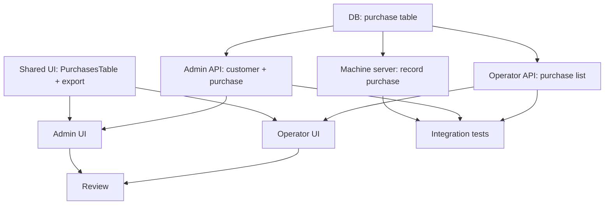

# Execution plan: Billing Dashboard (`billing-dashboard`)

## 0. Workflow preflight

| Check | Status / action |
|-------|----------------|
| `00-requirements.md` | Present |
| `01-ui-spec.md` | Present |
| `02-test-spec.md` | Present |
| Git branch | Create `feat/billing-dashboard` from `main` **after** `feat/operator-machine-lifecycle` is merged |
| Depends on | `operator-machine-lifecycle` fully merged: `business_entity`, `operator_contract`, `machine_deployment`, `machine_slot_config`, `machine_slot` enum all in DB |

### Human checkpoint 1 (before DB migrate / prod)

- **Backup database.**
- Confirm `operator-machine-lifecycle` tables are present in target DB.
- Confirm `operator_product` table is present.

### Human checkpoint 2 (before merge)

- Machine can POST `/purchase` → row appears in DB.
- Operator sees only their org's purchases; cross-org attempt blocked.
- Date + entity filters work.
- CSV export downloads a valid ZIP with `purchases.csv`.
- Admin customer list shows machine counts.
- Admin customer-detail shows entities, machines, purchases.
- Admin machine-detail shows purchases, slot config, contract, and "Configure Contract" button navigates with pre-filled query params.

---

## 1. Thinking

### 1.1 Invisible knowledge (read before coding)

**Purchase attribution at write time**
The machine server must resolve `organizationId` and `businessEntityId` at write time (denormalised). This avoids expensive joins on every read.

- `organizationId`: query `operator_contract` base table joined with its current version row (where `status = 'active'`) filtered by `machineId`. The model-factory versioned entity has a `currentVersionId` on the base; join `operator_contract` with `operator_contract_version` on `id = currentVersionId` where `status = 'active'`.
- `businessEntityId`: query `machine_deployment` where `machineId = :id AND endedAt IS NULL`. Take `.businessEntityId`. Nullable if none found.

**machine_slot enum already defined**
`machine_slot` (`left` | `middle` | `right`) is already defined in `packages/db/src/schema/machine-lifecycle.ts` as `machineSlotEnum`. Import and reuse it in the `purchase` table — do **not** redefine.

**operator_contract version table**
`operatorContractVersion` is exported as `any` in the schema (model-factory limitation). Use Drizzle `sql` template or raw fields when querying the version table if the inferred type is incomplete.

**Admin "machines for org" query**
Machines belonging to an org = `operator_contract` base rows where `organizationId = :orgId`. Join with `machine` + `machineVersion`. Current contract status = join with current version. This may return duplicate machines (multiple contracts) — use `DISTINCT ON (machine.id)` or group by machine ID taking the latest status.

**Contracts page accepts query params (pre-fill)**
The existing `/_admin/contracts` route may not yet support `?organizationId=&machineId=` query params for pre-filling. The admin-UI task (T05) must add this `search` param support to the contracts route's `Route.validateSearch` and pass the values to the create-contract form as defaults.

**CSV / ZIP — client-side only**
Use `jszip` (already may be installed; check before adding). Alternatively, `fflate` for a lighter-weight option. Generate entirely in the browser — no server roundtrip. Fetch all filtered rows first if pagination is active.

**TanStack Router dynamic params**
`/_admin/customers/$customerId/machines/$machineId` requires a new nested file route:
`apps/admin-frontend/src/routes/_admin/customers.$customerId.machines.$machineId.tsx`
(flat-file convention) or a subfolder structure — follow the convention already used in `_protected/$orgSlug/machines.$machineId.tsx`.

**Operator machine purchases route**
`apps/operator-frontend/src/routes/_protected/$orgSlug/machines.$machineId.purchases.tsx` — nested under the existing machine detail file. TanStack Router flat file convention.

### 1.2 Layer breakdown

1. **Database (T00)** — `purchase` table + indexes; reuse `machineSlotEnum`.
2. **Machine server (T01)** — `POST /purchase`; org resolution; guard; insert.
3. **Admin API (T02)** — `admin.customer.list/get`; `admin.purchase.list` (filters).
4. **Operator API (T03)** — `operator.purchase.list` (org-scoped, filters).
5. **Shared UI (T04)** — `PurchasesTable` composite; CSV export utility.
6. **Admin UI (T05)** — customers list + customer-detail (tabs) + machine-detail.
7. **Operator UI (T06)** — purchases page + machine purchases page; CSV export wiring.
8. **Integration tests (T07)** — I-1 through I-10.

### 1.3 Migration strategy (DB)

Single migration file:
1. `purchase` table referencing `machine`, `organization`, `business_entity`, `operator_product` and using the existing `machine_slot` enum.
2. Three composite indexes.

No enum changes. No existing table modifications.

### 1.4 Dependency order



**Parallelism:** T04 (shared UI) can start immediately with mocked props. T01, T02, T03 unblock in parallel after T00. T05 and T06 unblock after T02/T03 + T04.

---

## 2. Execution order table

| Step | Task ID | Agent | Depends on | Notes |
|------|---------|-------|------------|-------|
| 0 | T00 | db-agent | — | `purchase` table + indexes |
| 1 | T01 | api-agent | T00 | Machine server POST /purchase |
| 2 | T02 | api-agent | T00 | Admin customer + purchase tRPC |
| 3 | T03 | api-agent | T00 | Operator purchase tRPC |
| 4 | T04 | frontend-agent | — | Shared UI (parallel T00) |
| 5 | T05 | frontend-agent | T02, T04 | Admin UI |
| 6 | T06 | frontend-agent | T03, T04 | Operator UI |
| 7 | T07 | test-writer-agent | T01, T02, T03 | Integration tests I-1 – I-10 |
| 8 | T08 | reviewer-agent | T05, T06 | Optional final review |

---

## 3. Per-task definitions

### T00 — Schema: `purchase` table

```
Task ID: T00
Agent: db-agent
Layer: packages/db
Description:
  - Add purchase table to packages/db/src/schema/ (new file: purchase.ts).
  - Import machineSlotEnum from ./machine-lifecycle (do NOT redefine).
  - FK: machineId → machine.id (restrict), organizationId → organization.id (restrict),
        businessEntityId → business_entity.id (set null), operatorProductId → operator_product.id (restrict).
  - businessEntityId nullable.
  - Columns: id text PK, machineId, organizationId, businessEntityId, operatorProductId,
             slot machineSlotEnum NOT NULL, amountInCents integer NOT NULL,
             purchasedAt timestamp NOT NULL defaultNow, createdAt timestamp NOT NULL defaultNow.
  - Indexes: (organizationId, purchasedAt), (machineId, purchasedAt), (businessEntityId, purchasedAt).
  - Export from packages/db/src/schema/index.ts.
  - Run drizzle-kit generate to produce migration.
Artifact: packages/db/src/schema/purchase.ts, migration
Commit: feat(db): purchase table for machine transaction records
Depends on: —
Risk: low
```

---

### T01 — Machine server: record purchase endpoint

```
Task ID: T01
Agent: api-agent
Layer: apps/machine-server
Description:
  - Add POST /purchase route protected by machineAuthMiddleware.
  - Zod input: { operatorProductId: string, slot: "left"|"middle"|"right", amountInCents: number (int, > 0) }.
  - Resolve machineId from c.get("machineId").
  - Resolve organizationId: query operator_contract base joined with operator_contract_version
    where machineId = :machineId AND version.status = 'active' AND base.currentVersionId = version.id.
    If not found → 422 { code: "NO_ACTIVE_CONTRACT" }.
  - Resolve businessEntityId: query machine_deployment where machineId = :machineId AND endedAt IS NULL.
    If none → businessEntityId = null (allowed).
  - Insert purchase row. Return 201 { id, purchasedAt }.
  - Add MACHINE_ERROR_CODES.NO_ACTIVE_CONTRACT to errors.ts.
  - Wire route in apps/machine-server/src/index.ts.
Artifact: apps/machine-server/src/routes/purchase.ts, apps/machine-server/src/index.ts (updated)
Commit: feat(machine-server): record purchase endpoint
Depends on: T00
Risk: medium (model-factory version table query pattern)
```

---

### T02 — Admin API: customer + purchase tRPC

```
Task ID: T02
Agent: api-agent
Layer: apps/server
Description:
  - New router: admin-customer.ts
    - admin.customer.list: list organizations ordered by createdAt desc;
      join to count machines with active contracts (machineCount).
      Output: { id, name, slug, createdAt, machineCount }[].
    - admin.customer.get({ organizationId }): single org row.
    - admin.customer.listMachines({ organizationId }): machines with at least one contract for org;
      include machineId, versionNumber, current contract status, hasOpenDeployment boolean.
  - New router: admin-purchase.ts
    - admin.purchase.list({ organizationId?, machineId?, startDate?, endDate?, businessEntityId?, limit?, cursor? }):
      query purchase table with optional filters; join operatorProduct for name.
      Output: PurchaseRow[] with productName, businessEntityName (join business_entity).
  - Merge both routers into adminRouter (admin.ts).
Artifact: apps/server/src/trpc/routers/admin-customer.ts,
          apps/server/src/trpc/routers/admin-purchase.ts,
          apps/server/src/trpc/routers/admin.ts (updated imports)
Commit: feat(api): admin customer list and purchase procedures
Depends on: T00
Risk: medium
```

---

### T03 — Operator API: purchase list

```
Task ID: T03
Agent: api-agent
Layer: apps/server
Description:
  - New router: operator-purchase.ts
    - operator.purchase.list({ orgSlug, machineId?, startDate?, endDate?, businessEntityId?, limit?, cursor? }):
      resolveOrgIdFromSlug + assertUserMemberOfOrg (existing helpers).
      Filter purchase table by organizationId. Optional machineId, date range, businessEntityId filters.
      Join operator_product for productName, business_entity for businessEntityName.
      Output: PurchaseRow[].
  - Merge into operatorRouter (operator.ts).
Artifact: apps/server/src/trpc/routers/operator-purchase.ts,
          apps/server/src/trpc/routers/operator.ts (updated)
Commit: feat(api): operator purchase list procedure
Depends on: T00
Risk: medium (auth boundary)
```

---

### T04 — Shared UI: PurchasesTable + CSV export

```
Task ID: T04
Agent: frontend-agent
Layer: packages/ui
Description:
  - packages/ui/src/composite/purchases-table.tsx:
    PurchasesTable component per 01-ui-spec props interface.
    Uses Shadcn Table, Skeleton, Empty components.
    Columns: Date/Time, Machine (conditional), Slot, Product, Amount (EUR), Entity (conditional).
    Filter row above table: date range pickers, entity select, machine select, export button.
    No tRPC — props/callbacks only.
  - packages/ui/src/composite/purchases-export.ts:
    exportPurchasesToZip(rows: PurchaseRow[], orgSlug: string): Promise<void>
    Uses jszip (or fflate). Generates CSV string, wraps in ZIP, triggers browser download.
    Column order: Date, Time, Machine ID, Slot, Product, Amount (EUR), Business Entity.
    Amount = amountInCents / 100 formatted to 2 decimal places.
  - Export both from packages/ui barrel or composite index.
Artifact: packages/ui/src/composite/purchases-table.tsx,
          packages/ui/src/composite/purchases-export.ts
Commit: feat(ui): PurchasesTable composite and CSV export utility
Depends on: — (parallel; use mocked PurchaseRow type)
Risk: low
```

---

### T05 — Admin UI

```
Task ID: T05
Agent: frontend-agent
Layer: apps/admin-frontend
Description:
  1. /_admin/customers (existing stub → implement):
     - Wire admin.customer.list.
     - Table with columns: Name, Slug, Active machines, Created.
     - "New Customer" button → links to /_admin/create-customer.
     - Row click → navigate to /_admin/customers/$customerId.

  2. /_admin/customers.$customerId.tsx (new route):
     - Tabs: Overview (business entities), Machines, Products, Purchases.
     - Overview: admin.businessEntity.listByOrganization + "Add Entity" action.
     - Machines: admin.customer.listMachines; row click → /_admin/customers/$customerId/machines/$machineId.
     - Products: admin.operatorProduct.list (or equivalent) for this org (read-only grid).
     - Purchases: PurchasesTable + admin.purchase.list({ organizationId }); showMachineColumn, showEntityColumn.

  3. /_admin/customers.$customerId.machines.$machineId.tsx (new route):
     - Header with "Configure Contract" button → /_admin/contracts?organizationId=&machineId= query params.
     - Purchases section: PurchasesTable + admin.purchase.list({ machineId }).
     - Slot config section: read-only slot display (operator.machineSlot.getConfigForMachine or a new admin read).
     - Contract section: latest contract card (admin.operatorContract.list filtered to machineId; take first result).
     
  4. /_admin/contracts route: add Route.validateSearch to accept organizationId + machineId query params;
     pre-fill create-contract form if params present.

Artifact: apps/admin-frontend/src/routes/_admin/customers.tsx (updated),
          apps/admin-frontend/src/routes/_admin/customers.$customerId.tsx (new),
          apps/admin-frontend/src/routes/_admin/customers.$customerId.machines.$machineId.tsx (new),
          apps/admin-frontend/src/routes/_admin/contracts.tsx (updated validateSearch)
Commit: feat(admin): customers list, customer detail, and machine detail views
Depends on: T02, T04
Risk: medium (new nested routes)
```

---

### T06 — Operator UI

```
Task ID: T06
Agent: frontend-agent
Layer: apps/operator-frontend
Description:
  1. /_protected/$orgSlug/purchases.tsx (new route):
     - Filter state (dateFrom, dateTo, businessEntityId, machineId) in component state or URL search params.
     - Wire operator.purchase.list with filter params.
     - PurchasesTable with showMachineColumn: true, showEntityColumn: true.
     - Export CSV button → call exportPurchasesToZip(data, orgSlug).
     - Machine cards grid: operator.machine.list (already exists) to get org machines; link each to /$orgSlug/machines/$machineId/purchases.
     - Add "Purchases" nav link to operator sidebar/nav.

  2. /_protected/$orgSlug/machines.$machineId.purchases.tsx (new route):
     - Pre-filtered to machineId from params.
     - Wire operator.purchase.list({ orgSlug, machineId }).
     - PurchasesTable with showMachineColumn: false, showEntityColumn: true.
     - Export CSV with machineId in filename.
     - Back link to /$orgSlug/machines.

Artifact: apps/operator-frontend/src/routes/_protected/$orgSlug/purchases.tsx (new),
          apps/operator-frontend/src/routes/_protected/$orgSlug/machines.$machineId.purchases.tsx (new),
          nav update in operator shell/layout
Commit: feat(operator): purchases page with filter, export, and machine purchases
Depends on: T03, T04
Risk: medium (CSV/ZIP client-side)
```

---

### T07 — Integration tests

```
Task ID: T07
Agent: test-writer-agent
Layer: Testing
Description:
  - Cover I-1 through I-10 from 02-test-spec.md using PGlite pattern.
  - Machine server tests require Hono test client (hono/testing or supertest pattern).
  - tRPC tests use standard repo createCaller pattern.
  - U-1: unit test for CSV export utility (pure function).
Depends on: T01, T02, T03
Risk: low
```

---

### T08 — Review (optional)

```
Task ID: T08
Agent: reviewer-agent
Layer: Review
Description: Security (org isolation, machine auth, admin-only mutations), purchase attribution correctness, CSV export, query performance (index usage).
Depends on: T05, T06
Risk: low
```

---

## 4. Subagent cheat sheet

| Agent | Use for |
|-------|---------|
| **db-agent** | T00 |
| **api-agent** | T01, T02, T03 |
| **frontend-agent** | T04, T05, T06 |
| **test-writer-agent** | T07 |
| **reviewer-agent** | T08 |

---

## 5. Done criteria

- [ ] `purchase` table in DB with indexes; migration generated.
- [ ] Machine `POST /purchase` creates row; `NO_ACTIVE_CONTRACT` guard works.
- [ ] `operator.purchase.list` scoped to org; cross-org blocked.
- [ ] `admin.purchase.list` can filter by org, machine, date, entity.
- [ ] `admin.customer.list` returns machineCount correctly.
- [ ] `PurchasesTable` renders all columns; filter row functional.
- [ ] `exportPurchasesToZip` produces valid ZIP with `purchases.csv`.
- [ ] Admin customers page shows table + "New Customer" button.
- [ ] Admin customer-detail shows tabs: entities, machines, products, purchases.
- [ ] Admin machine-detail shows purchases + slot config + contract + "Configure Contract" button navigates with query params.
- [ ] Operator purchases page: filter works; export downloads ZIP.
- [ ] Operator machine purchases page accessible from machine cards.
- [ ] Integration tests I-1 – I-10 green (or gaps documented).
