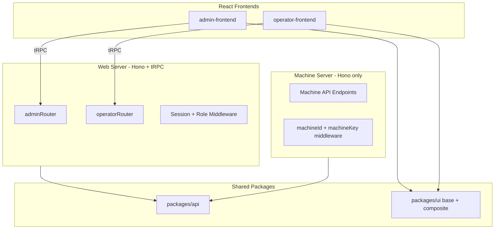

# Core Infrastructure Setup Plan

## Summary

Set up the core infrastructure: split frontends (admin, operator), restructure UI package (base/composite) with Shadcn monorepo support, add tRPC router separation with admin/operator middleware, configure Better Auth admin + organization plugins with type discriminator for orgs, create machine server (Hono-only) with machineId/machineKey auth middleware (stub for now), and extract shared utilities into `@slushomat/api`. Sign-up type/domain validation is reserved for a later ticket.

## Architecture Overview



---

## 1. Shared API Package (`packages/api` / `@slushomat/api`)

- Name: `@slushomat/api` (shared-api)
- Will hold tRPC shared types, Zod schemas, etc. in the future
- Current contents:
  - Reusable Hono middleware: cors, secureHeaders, request logging pattern
  - General error-throwing behavior / HTTP error helpers (where it makes sense)
  - Error handling utilities (HTTPException, ZodError formatter)
  - Health/ready endpoint helpers
- No tRPC types yet — add when needed

---

## 2. Better Auth: Admin Plugin and Role in Session

- Admin plugin adds `role` to user table; `getSession()` returns `session.user.role`
- tRPC middleware: `adminProcedure` checks `session?.user?.role === "admin"` (or adminUserIds)
- **Sign-up type / domain validation**: Reserved for a later ticket (not part of core infrastructure)

---

## 3. Better Auth: Organization Plugin — Discriminator Approach

- Single `organization` table with `type: 'operator' | 'slushomat'` as additionalField
- All orgs in one table; filter by `type` in queries
- Slushomat internal: `type = 'slushomat'`
- Operator orgs: `type = 'operator'`

---

## 4. UI Package: Base and Composite Structure (Shadcn Monorepo)

**Goal:** Shared UI package with Shadcn base components and custom composite components. Each app has its own `components/` for app-specific pieces.

**Structure:**

```
packages/ui/
├── src/
│   ├── base/           # Shadcn base components (button, input, card, etc.)
│   ├── composite/      # Shared composite components built on base
│   ├── lib/            # utils (cn), etc.
│   ├── hooks/          # use-theme, etc.
│   └── styles/
│       └── globals.css
├── components.json
└── package.json

apps/admin-frontend/
├── components/         # App-specific components
├── components.json
└── ...
```

**Shadcn monorepo setup (from [ui.shadcn.com/docs/monorepo](https://ui.shadcn.com/docs/monorepo)):**

1. **packages/ui/components.json** — Point `ui` alias to base so CLI installs Shadcn components into `base/`:
   - `"ui": "@slushomat/ui/base"` (CLI uses this to determine installation path)
   - `"components": "@slushomat/ui/base"` (for consistency within ui package)
   - Match `style`, `baseColor`, `iconLibrary` across all workspace `components.json` files

2. **packages/ui/package.json** — Exports:
   - `"./base/*": "./src/base/*.tsx"`
   - `"./composite/*": "./src/composite/*.tsx"`
   - Keep existing `globals.css`, `lib/*`, `hooks/*`

3. **Migration:** Move existing `packages/ui/src/components/*` to `packages/ui/src/base/`, update imports.

4. **App components.json (admin-frontend, operator-frontend):**
   - `"components": "@/components"` — app-specific (blocks from registry go here)
   - `"ui": "@slushomat/ui/base"` — base components from shared package
   - `"utils": "@slushomat/ui/lib/utils"`, `"hooks": "@slushomat/ui/hooks"`

5. **Import patterns:**
   - Base: `import { Button } from "@slushomat/ui/base/button"`
   - Composite: `import { DataTable } from "@slushomat/ui/composite/data-table"`
   - App: `import { AdminNav } from "@/components/admin-nav"`

6. **Adding components:** Run `npx shadcn@latest add [component]` from any app; CLI installs to `packages/ui/src/base/` based on aliases.

---

## 5. Frontend Split and apps/web Removal

- **apps/admin-frontend**: New React app (Vite, TanStack Router, tRPC)
- **apps/operator-frontend**: New React app (same stack)
- **apps/web**: Delete
- Each app has `components/` for app-specific components

---

## 6. Web Server: tRPC Router Separation

- Router layout: merge(adminRouter, operatorRouter, publicRouter)
- Procedures: `publicProcedure`, `protectedProcedure`, `adminProcedure`, `operatorProcedure`
- Mount admin routes under `admin.*`, operator under `operator.*`

---

## 7. Machine Server (`apps/machine-server`)

- Standalone Hono app (no tRPC)
- Imports shared middleware from `@slushomat/api`
- **Auth**: machineId + machineKey (not Better Auth)
- **Middleware**: Validates machineId + machineKey against database; rejects unauthorized combinations
- **Machine-specific error codes**: Defined in machine server (e.g. INVALID_MACHINE_CREDENTIALS, MACHINE_DISABLED)
- **For now**: Add comments for the auth check and allow every request (no machine credentials in DB yet; still in development)

---

## File / Package Changes Summary

| Action | Path |
|--------|------|
| Create | `packages/api` — shared Hono middleware, error handling, future tRPC types |
| Create | `apps/admin-frontend` — React app for admins, with `components/` and `components.json` |
| Create | `apps/operator-frontend` — React app for operators, with `components/` and `components.json` |
| Create | `apps/machine-server` — Hono-only machine API with machine auth middleware (stub) |
| Modify | `packages/ui` — restructure to `base/` and `composite/`, update components.json and exports |
| Modify | `packages/auth` — add admin + organization plugins |
| Modify | `packages/db` — schema for admin (role, etc.) and organization with type discriminator |
| Modify | `apps/server` — split tRPC into admin/operator routers and procedures |
| Delete | `apps/web` |

---

## Deferred to Later Ticket

- Sign-up type and domain validation (Slushomat vs operator, email domain check)
