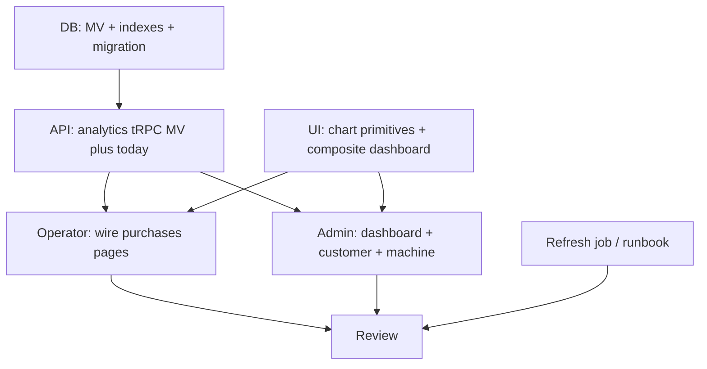

# Execution plan: Enhanced Analytics Dashboard (`enhanced-analytics-dashboard`)

## 0. Workflow preflight

| Check | Status / action |
|-------|----------------|
| `00-requirements.md` | Present |
| `01-ui-spec.md` | Present |
| `02-test-spec.md` | Present (tests **waived** — see file) |
| `npx tsx src/scripts/workflows/plan.ts` | **Not in repo** — this plan is authored manually (same pattern as `billing-dashboard`, `operator-products`, `machines-admin`) |
| Git branch | **Create** `feat/enhanced-analytics-dashboard` from `main` before implementation (currently on `main` is not ideal per workflow) |
| Depends on | **`billing-dashboard` merged and live** — `purchase` table, `operator.purchase.list` / `admin.purchase.list`, operator + admin purchase UIs must exist |

### Human checkpoint 1 (before DB migrate / prod)

- Backup database.
- Confirm `purchase`, `operator_contract` (+ versions with `monthlyRentInCents`, `revenueShareBasisPoints`, `effectiveDate`, `endedAt`, `status`), and indexes on `purchase` exist.
- Agree **timezone**: **Europe/Berlin** for all bucket boundaries and “today” (handles CET/CEST).

### Human checkpoint 2 (before merge)

- Operator org purchases page: charts above table; table filters unchanged; charts follow same date / machine / entity filters (machine view: **no** entity filter).
- Admin `/dashboard`: **only** platform-wide admin chart suite (not customer charts).
- Admin customer + machine detail: **same** chart suites as operator (scoped to that org / machine); **no** platform-wide charts on those pages.
- MV refresh job runs (or manual refresh verified); “yesterday and earlier” from MV + “today” live leg shows no double-counting.
- Tooltips work; chart clicks do **not** filter the table (align implementation with `01-ui-spec.md` hover-first UX).

---

## 1. Thinking

### 1.1 Invisible knowledge (read before coding)

**IDs are `text`, not UUID**  
Postgres/Drizzle schemas use `text` primary keys. Any materialized view or index definition must use `text` for `organization_id`, `machine_id`, etc. (do not copy `UUID` from early drafts).

**Contract version “at time of purchase”**  
`revenueShareBasisPoints` and `monthlyRentInCents` live on **version** rows. For each `purchase.purchasedAt`, the applicable version for that `machineId` is the version where:

- Version is the **current** row linked from contract base’s `currentVersionId` **only if** you intentionally want “latest contract” — **wrong** for historical accuracy.
- Correct approach: temporal match on **version** `effectiveDate` / `endedAt` (and typically `status` history) such that `purchasedAt` falls in the version’s validity window. **Confirm** the versioned-entity factory’s semantics (how `endedAt` on version interacts with superseding versions). If in doubt, mirror the same pattern used elsewhere for “contract active at date” queries.

**Revenue share cost (platform) vs operator revenue**  
Per requirements:

- `revenue_share_cost_cents = floor(amountInCents * revenueShareBasisPoints / 10000)` (confirm rounding policy in code — document in API).
- `operator_revenue` for a period is **not** simply `sales - rent - revenue_share` on arbitrary groupings without defining **rent allocation**:
  - **Per machine**: that machine’s `monthlyRentInCents` prorated across **calendar days** in Europe/Berlin for the selected month (handle contract mid-month changes by splitting days per active version).
  - **Org rollup**: sum prorated rent across machines that belong to the org **for that day** (machines with an active contract version covering that day).

**Hybrid MV + “today”**  
- MV holds **closed** days only: `bucket_date < today_in_europe_berlin` (or `< current_date` in a session set to `Europe/Berlin`).
- Live query aggregates `purchase` for `[start_of_today, now)` in Berlin for the same dimensions.
- Merge in app **or** `UNION ALL` in SQL; columns must align. Guard against **double inclusion** on the Berlin date boundary.

**Materialized view refresh**  
- Use `REFRESH MATERIALIZED VIEW CONCURRENTLY` only with a **UNIQUE** index on the MV’s grain (e.g. `(bucket_date, organization_id, machine_id, grain_type)` — exact key depends on chosen schema).
- Scheduling is **outside** Postgres unless you add pg_cron / Supabase cron: document **where** the job runs (e.g. Supabase scheduled Edge Function, GitHub Action, worker) and that it runs **after** midnight Berlin **or** “end of yesterday” in Berlin.

**JSONB breakdowns in MV**  
Pre-aggregated `product_breakdown` / `business_entity_breakdown` simplify charts but complicate MV refresh SQL. Alternative acceptable v1: MV stores **scalar** daily per `(org, machine)` totals; **separate** smaller MVs or on-the-fly aggregated queries for pie charts — trade refresh time vs query time. Pick one approach in T00 and stick to it.

**shadcn Chart**  
`packages/ui` may not yet include `chart.tsx` / Recharts wiring. Add the shadcn **Chart** primitive once in `packages/ui` (or the app if you intentionally keep charts app-local — requirements say **composite in `packages/ui`**, so prefer `packages/ui`).

**Route map (admin)**  
- Platform charts: `apps/admin-frontend/src/routes/_admin/dashboard.tsx` (currently placeholder “admin dashboard content”).
- Customer charts: customer detail route under `_admin/customers/$customerId/`.
- Machine charts: `/_admin/customers/$customerId/machines/$machineId` (or equivalent nested route).

**FR-007 vs UI spec**  
Requirements mention click interactions; UI spec emphasises **hover tooltips** and **no table filtering**. Implement **rich tooltips + keyboard focus**; do **not** wire chart clicks to table filters.

### 1.2 Layer breakdown

1. **T00 — DB** — Materialized view(s) + unique index + migration; document grain and refresh.
2. **T01 — API** — tRPC analytics: org-scoped, machine-scoped, admin platform-scoped; MV ∪ today; CET boundaries.
3. **T02 — Shared UI** — shadcn Chart setup + `AnalyticsDashboard` / chart cards in `packages/ui/src/composite/`.
4. **T03 — Operator UI** — Embed analytics above purchases table (org + machine pages).
5. **T04 — Admin UI** — `/dashboard` platform charts; customer + machine pages get operator-equivalent charts only.
6. **T05 — Ops / jobs** — Document + implement refresh trigger (cron or manual script checked in).
7. **T06 — Review** — Optional reviewer pass.

### 1.3 Dependency order



**Parallelism:** T02 can start with **mocked** API responses while T01 is in progress. T05 can start after T00 (SQL documented) in parallel with T01.

---

## 2. Execution order table

| Step | Task ID | Agent | Depends on | Notes |
|------|---------|-------|------------|-------|
| 0 | T00 | db-agent | — | MV schema + migration + unique index for CONCURRENTLY |
| 1 | T01 | api-agent | T00 | `operator.analytics.*`, `admin.analytics.*` (platform + scoped) |
| 2 | T02 | frontend-agent | — (mock) / T01 (wire) | `packages/ui` chart + composites |
| 3 | T03 | frontend-agent | T01, T02 | Operator purchases + machine purchases |
| 4 | T04 | frontend-agent | T01, T02 | Admin `/dashboard` + customer + machine |
| 5 | T05 | shell / devops | T00 | Cron/script + runbook for REFRESH CONCURRENTLY |
| 6 | T06 | reviewer-agent | T03, T04, T05 | Optional |

---

## 3. Per-task definitions

### T00 — Database: analytics materialized view(s)

```
Task ID: T00
Agent: db-agent
Layer: packages/db + SQL migration
Description:
  - Define materialized view grain for closed days (Europe/Berlin): e.g. daily per (organizationId, machineId)
    with purchase_count, sum amountInCents, revenue_share_cents (from contract-at-purchase logic), optional JSON breakdowns OR defer breakdowns to separate queries (document choice).
  - Add UNIQUE index required for REFRESH CONCURRENTLY.
  - Add plain indexes matching query patterns: by organizationId + bucket_date, by machineId + bucket_date.
  - Migration only; optional SQL comment block documenting "today excluded from MV".
  - Do NOT encode business rules only in undocumented SQL — cross-link to a short README under .cursor/tickets/enhanced-analytics-dashboard/ or packages/db/docs if needed.
Artifact: migration SQL, optional packages/db view definitions
Commit: feat(db): analytics materialized view for purchase aggregates
Depends on: —
Risk: high (temporal contract logic, DST, MV refresh)
```

### T01 — API: analytics tRPC procedures

```
Task ID: T01
Agent: api-agent
Layer: apps/server
Description:
  - Add router(s) e.g. operator.analytics + admin.analytics with procedures parameterized by:
    - mode: day | week | month
    - anchor: selected period (calendar week/month/day from client)
    - filters: organization (from orgSlug), optional machineId, optional businessEntityId (disallowed for machine-level machine chart API — return 400 if passed)
  - Implement server-side "MV ∪ today" merge with Europe/Berlin boundaries.
  - Admin platform procedures: aggregate across orgs (adminProcedure only); no org slug.
  - Reuse existing membership / admin guards; no cross-org leakage for operators.
  - Return chart-ready DTOs (series for bar/line/area, segments for pie) to keep UI thin.
Artifact: new router files, types exported to client
Commit: feat(api): analytics endpoints for dashboards
Depends on: T00
Risk: high
```

### T02 — Shared UI: charts + composite dashboard

```
Task ID: T02
Agent: frontend-agent
Layer: packages/ui
Description:
  - Add shadcn Chart / Recharts base (ChartContainer, config, tooltip) per ui.shadcn.com chart docs.
  - Implement composites under packages/ui/src/composite/:
    - AnalyticsDashboard (org suite: 6 charts)
    - MachineAnalyticsDashboard (3 charts)
    - AdminPlatformAnalyticsDashboard (4 charts)
  - Include loading skeletons, error boundary per chart card, "last updated" badge slot.
  - No tRPC inside composites — props + callbacks only.
Artifact: packages/ui composite components + exports
Commit: feat(ui): analytics dashboard chart composites
Depends on: — (mock data) / T01 for integration
Risk: medium
```

### T03 — Operator UI: wire purchases pages

```
Task ID: T03
Agent: frontend-agent
Layer: apps/operator-frontend
Description:
  - On org purchases route: render AnalyticsDashboard above PurchasesTable; sync date/machine/entity filters with chart query inputs (table behaviour unchanged).
  - On machine purchases route: render MachineAnalyticsDashboard; remove business entity filter from UI if still present; date filter remains.
  - Time controls: day/week/month toggle, prev/next, calendar popover — single state drives all charts.
  - Fetch analytics via tRPC; handle zeros for future days in current week/month.
Artifact: route files updated
Commit: feat(operator): purchases analytics charts
Depends on: T01, T02
Risk: medium
```

### T04 — Admin UI: dashboard + customer + machine

```
Task ID: T04
Agent: frontend-agent
Layer: apps/admin-frontend
Description:
  - Replace placeholder on /_admin/dashboard with AdminPlatformAnalyticsDashboard only (platform-wide charts).
  - Customer detail page: embed same AnalyticsDashboard as operator (scoped to customer orgId) — NO platform charts here.
  - Machine detail page: MachineAnalyticsDashboard for that machine only — NO entity filter.
  - Reuse composites from packages/ui; no duplicated chart code in apps.
Artifact: dashboard.tsx, customer index, machine detail route
Commit: feat(admin): analytics on dashboard and customer views
Depends on: T01, T02
Risk: medium
```

### T05 — Refresh job + runbook

```
Task ID: T05
Agent: shell / devops (or api-agent documenting operational SQL)
Layer: infra / scripts / docs
Description:
  - Document exact REFRESH MATERIALIZED VIEW CONCURRENTLY command and schedule (e.g. 00:10 Europe/Berlin).
  - Implement whichever mechanism the project uses (Supabase cron, script in apps/server/scripts, etc.).
  - Alerting / logging on failure (align with existing observability).
Artifact: script or cron config + short RUNBOOK.md in ticket folder or docs/
Commit: chore(ops): analytics MV refresh schedule
Depends on: T00
Risk: low–medium
```

### T06 — Review (optional)

```
Task ID: T06
Agent: reviewer-agent
Description:
  - Security: org isolation, admin-only platform routes.
  - Performance: EXPLAIN on hot paths; index use.
  - UX: matches 01-ui-spec (responsive, a11y basics).
Depends on: T03, T04, T05
```

---

## 4. Open decisions (resolve during T00 / T01)

1. **Rounding** of basis-point revenue share per purchase vs per aggregate (per purchase is auditable).
2. **MV grain**: single wide MV vs split (daily totals MV + nightly job building breakdown tables).
3. **Initial backfill**: one-off refresh after deploy vs gradual population.
4. **Failure of MV refresh**: fallback to live-only query for historical (slow) vs hard error — requirements suggest fallback + warning; implement minimally (e.g. log + degraded banner).

---

## 5. Resolved product decisions (do not re-litigate without PM)

| Topic | Decision |
|-------|----------|
| Admin platform charts | **Only** on `/dashboard` |
| Admin customer / machine | **Only** customer-scoped charts (mirror operator) |
| Table vs charts | Charts **above** table; **no** chart-driven table filtering |
| Timezone | **Europe/Berlin** |
| Periods | Calendar day / ISO or locale week / calendar month; **not** rolling windows |
| Machine page | **No** business entity column/filter |
| Tests | **Waived** for this feature (`02-test-spec.md`) |
