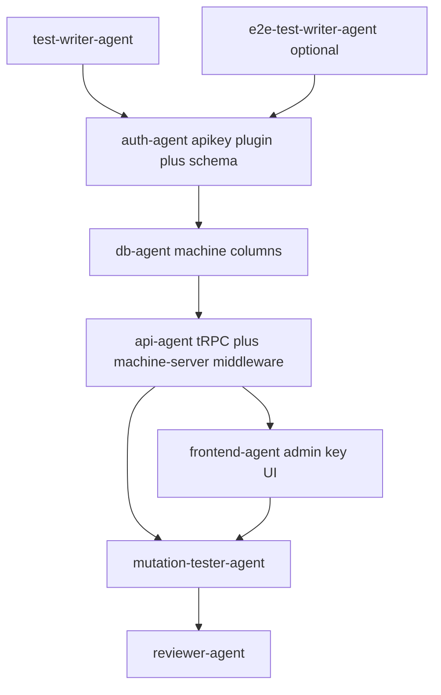

# Execution plan: Machine API keys (`machine-api-keys`)

## 1. Thinking

### Agent registry

`.cursor/skills/agent-registry.md` is **not present in this repository**; assignments below follow [`agent-registry.md`](file:///Users/joostwindmoller/.cursor/plugins/agent-stack/src/skills/agent-registry.md) from the Cursor agent-stack plugin (allowed agents: `db-agent`, `auth-agent`, `api-agent`, `frontend-agent`, `test-writer-agent`, `e2e-test-writer-agent`, `mutation-tester-agent`, `reviewer-agent`, …). **No `shell` agent** exists in the registry — integration tests are owned by **test-writer-agent**.

### Invisible knowledge (context for implementers)

- **Better Auth home:** [`packages/auth/src/index.ts`](packages/auth/src/index.ts) — `betterAuth({ database: drizzleAdapter(db, { schema }), plugins: [...] })`. Add **`apiKey()`** from `@better-auth/api-key` with a dedicated **`configId: "machine"`**, **`enableMetadata: true`**, **`defaultPrefix: "SLUSH_"`**, **`references: "user"`**. On `createApiKey` / rotate, pass **`userId`** = authenticated admin’s Better Auth user id; put **`machineId`** in **`metadata`**. Run **`pnpm auth:generate`** (root script targets this config) so Drizzle/Better Auth **`apikey`** table is generated into the shared schema; commit resulting migration SQL under **`packages/db/src/migrations/`** (or the path your generator emits — align with existing `db:generate` / `auth:generate` workflow).
- **Why not only “list keys for session user”:** Resolve “key for this machine” via **`machine.apiKeyId`** and/or server-side **`getApiKey` / DB** filtered by **`configId`** + **`metadata.machineId`**, so any admin sees any machine’s key state (per `00-requirements.md`).
- **Machine table today:** [`packages/db/src/schema/machines.ts`](packages/db/src/schema/machines.ts) — add **`disabled`** (`boolean`, default `false`), **`apiKeyId`** (`text`, nullable). **FK:** Prefer **`references(() => apiKey.id)`** in Drizzle *if* the generated `apikey` table lives in the same schema package; if cross-package or generator friction makes a formal FK awkward, use **nullable `text` + application-level integrity** and document that choice in code comments — still keep **unique “one active key per machine”** via rotation (delete old / replace `machine.apiKeyId`).
- **Indexes:** Primary key on `machine.id` already supports lookup by id; add an **index on `machine.apiKeyId`** if you query by key id from admin flows; ensure **`apikey`** plugin indexes (from Better Auth) are present after migration.
- **Admin API:** Extend **`adminProcedure`**-only procedures under [`apps/server/src/trpc/routers/admin.ts`](apps/server/src/trpc/routers/admin.ts) (or nested router pattern already used for `machine` / `machineVersion`). **Never** return full plaintext **`key`** except on **create / rotate** responses; list/detail returns **prefix, `start`, enabled, ids, timestamps** only.
- **Machine server:** [`apps/machine-server/src/index.ts`](apps/machine-server/src/index.ts) applies **`machineAuthMiddleware`** globally — **health must stay public** per AC-5 / product note: restrict middleware to protected paths (e.g. `app.use("/is-killed", …)` or skip `/healthz` inside middleware) so **`GET /healthz`** matches [`healthzResponse`](packages/api/src/health.ts) without auth.
- **Shared verification:** **`machine-server`** should use the **same `auth` instance and DB** as the main app — add a workspace dependency on **`@slushomat/auth`** (and env parity: `DATABASE_URL`, `BETTER_AUTH_*` as needed). Call **`auth.api.verifyApiKey`** (or documented server API) with **`configId: "machine"`**, then enforce **`metadata.machineId` === `X-Machine-Id`** (and/or consistency with **`machine.apiKeyId`**). Map outcomes: bad/revoked key or mismatch → **401** + [`MACHINE_ERROR_CODES.INVALID_MACHINE_CREDENTIALS`](apps/machine-server/src/errors.ts); **`machine.disabled`** → **403** + **`MACHINE_DISABLED`**.
- **Bearer header:** Parse **`Authorization: Bearer <token>`**; configure API key plugin (**`apiKeyHeaders`** / **`customAPIKeyGetter`**) so verification accepts that shape (per Better Auth docs).
- **Admin UI surface:** Today, machines are edited in a **sheet** on [`apps/admin-frontend/src/routes/_admin/machines.tsx`](apps/admin-frontend/src/routes/_admin/machines.tsx). Implement key flows **in that machine edit/create context** (or a dedicated detail sub-route if you split later) per `01-ui-spec.md`: generate / rotate / revoke, one-time secret modal, masked row after dismiss.
- **Tests:** Root scripts [`package.json`](package.json) — **`pnpm test`**, **`pnpm test:integration`** (`vitest run --project integration`). Integration tests live under **`tests/**/*.test.ts`** with **`tests/setup.ts`** per [`vitest.config.ts`](vitest.config.ts). **Do not** log bearer tokens in middleware or tests.

### Layer breakdown

1. **Tests (TDD)** — Failing integration (+ optional E2E) tests from `02-test-spec.md` before implementation.
2. **Auth** — `@better-auth/api-key` plugin, `configId` **`machine`**, metadata enabled, migrations/schema for **`apikey`**.
3. **Database** — `machine.disabled`, `machine.apiKeyId`, indexes as above.
4. **API / machine-server** — Admin tRPC for create/rotate/revoke + metadata; Hono middleware in **`apps/machine-server`** using shared `auth` + DB.
5. **Frontend** — Admin machine UI for key lifecycle and masked display.
6. **Mutation + review** — Stryker pass on testable surface, then reviewer sign-off.

### Dependency order



### Tests note

Integration coverage is **required** (`02-test-spec.md`). **E2E** is optional; **T02** may be deferred or reduced to a placeholder if product skips Playwright for v1 — still list the task so TDD ordering stays explicit. **Unit** tests are optional for small pure helpers (e.g. Bearer parsing).

---

## 2. Execution order table

| Step | Task ID | Agent | Depends on | Parallel with |
|------|---------|-------|------------|----------------|
| 1 | T01 | test-writer-agent | — | T02 |
| 2 | T02 | e2e-test-writer-agent | — | T01 |
| 3 | T03 | auth-agent | T01, T02 | — |
| 4 | T04 | db-agent | T03 | — |
| 5 | T05 | api-agent | T03, T04 | — |
| 6 | T06 | frontend-agent | T05 | — |
| 7 | T07 | mutation-tester-agent | T03, T04, T05, T06 | — |
| 8 | T08 | reviewer-agent | T07 | — |

---

## 3. Per-task definitions

### T01 — Unit + integration tests (write first)

```
Task ID: T01
Agent: test-writer-agent
Layer: Tests
Description:
  - Add Vitest integration tests under tests/**/*.test.ts (Node project per vitest.config.ts).
  - Setup: DB with machine + apikey tables and machine.disabled; create machine row + API key via production-equivalent path (auth.api.createApiKey with configId "machine", metadata.machineId, update machine.apiKeyId).
  - Happy path: HTTP request to machine-server protected route with Authorization: Bearer <plaintext> + X-Machine-Id → success (not /healthz).
  - Wrong pairing: valid key for machine A + X-Machine-Id B → 401 / INVALID_MACHINE_CREDENTIALS.
  - disabled: true → 403 / MACHINE_DISABLED.
  - After revoke/delete key → 401.
  - Optional: tRPC layer test — non-admin cannot create keys (if harness allows).
  - Security: assert logs/mocks do not capture raw bearer token.
  - Small unit tests for Bearer / header parsing helpers only if extracted.
Artifact: tests/machine-api-keys.integration.test.ts (or tests/integration/machine-api-keys.test.ts), tests/setup.ts updates if needed
Skills needed: skills/testing/_index.md, skills/testing/db-infra.md, skills/testing/trpc.md (if tRPC tests)
Commit message: test(machine-api-keys): add integration coverage for machine auth
Depends on: —
Risk: medium (first integration harness for machine-server + DB)
```

**Acceptance:** Tests exist and **fail** until T03–T05 are implemented; `pnpm test:integration` is the runner to document for CI.

---

### T02 — E2E (optional)

```
Task ID: T02
Agent: e2e-test-writer-agent
Layer: Tests
Description:
  - Optional Playwright (or repo E2E stack): admin generates key → modal shows full secret → dismiss → detail shows masked identity only (prefix + start). Defer or skip if no E2E infra in repo yet; do not block T03+.
Artifact: tests/e2e/machine-api-keys.spec.ts (path per team convention)
Skills needed: skills/testing/_index.md (E2E routing as in test spec)
Commit message: test(e2e): admin machine API key flow
Depends on: —
Risk: low
```

**Acceptance:** Spec exists or an explicit “deferred” note in ticket; no implementation before T05–T06 if pursued.

---

### T03 — Better Auth API Key plugin + apikey schema

```
Task ID: T03
Agent: auth-agent
Layer: Auth
Description:
  - Add dependency @better-auth/api-key; register apiKey({ ... }) with configId "machine", enableMetadata: true, defaultPrefix: "SLUSH_", references: "user", startingCharactersConfig as needed for UI "start".
  - Ensure createApiKey calls use userId = session admin id and metadata.machineId.
  - Run auth generate / migrate per Better Auth docs so apikey table exists; merge generated Drizzle tables into packages/db schema exports if required by adapter.
  - Do not enable disableKeyHashing in production.
  - Export or document server-side verifyApiKey usage for machine-server (same auth singleton).
Artifact: packages/auth/src/index.ts, packages/auth/package.json, packages/db/src/schema/* (apikey tables if generated here), new SQL migration(s)
Skills needed: skills/auth/ (Better Auth plugin + adapter patterns)
Commit message: feat(auth): add machine API key plugin and apikey schema
Depends on: T01, T02
Risk: medium (generator + schema merge)
```

**Acceptance:** **AC-1**, **AC-7** (hashed storage, no plaintext column); plugin configured as specified.

---

### T04 — Machine row: disabled + apiKeyId

```
Task ID: T04
Agent: db-agent
Layer: Database
Description:
  - Extend machine table: disabled boolean default false, apiKeyId text nullable; FK to apikey.id if schema allows, else nullable text + comment.
  - Add index on apiKeyId if queried.
  - drizzle-kit generate + commit migration; align with team db:push / db:migrate.
Artifact: packages/db/src/schema/machines.ts, packages/db/src/schema/index.ts, packages/db/src/migrations/*
Skills needed: skills/database/_index.md, skills/database/schema.md, skills/database/migrations.md
Commit message: feat(db): add machine disabled and apiKeyId
Depends on: T03
Risk: low
```

**Acceptance:** **AC-2**, **AC-4** data model; migrations apply cleanly after apikey exists.

---

### T05 — Admin tRPC + machine-server middleware

```
Task ID: T05
Agent: api-agent
Layer: API / Backend
Description:
  - Admin tRPC (adminProcedure only): procedures to create, rotate, revoke machine key; fetch key metadata for UI (prefix, start, enabled, ids, timestamps) — never full secret except create/rotate payloads.
  - Enforce one logical key per machine: rotation revokes/deletes previous key and updates machine.apiKeyId; revoke clears apiKeyId.
  - Resolve keys by machine id server-side (not “only my keys” list semantics).
  - machine-server: implement machineAuthMiddleware — parse Bearer, read X-Machine-Id, verifyApiKey (configId machine), bind metadata to machine id, load machine row, check disabled; 401 vs 403 per MACHINE_ERROR_CODES; exclude /healthz from auth requirement.
  - Wire machine-server dependency on @slushomat/auth + env; avoid duplicating Better Auth config (single createAuth / exported auth from packages/auth).
  - Add or reuse a minimal protected route for integration tests (e.g. existing /is-killed behind auth).
Artifact: apps/server/src/trpc/routers/admin.ts (and related), apps/machine-server/src/middleware/machine-auth.ts, apps/machine-server/src/index.ts (middleware scope), apps/machine-server/package.json, optional packages/auth or packages/api helper exports
Skills needed: hono.md, trpc.md, skills/auth/, skills/database/_index.md + queries.md
Commit message: feat(api): machine API keys admin procedures and machine-server auth
Depends on: T03, T04
Risk: high (cross-app auth, security-sensitive)
```

**Acceptance:** **AC-2**, **AC-3**, **AC-5**, **AC-6** (with T01 passing); wrong pairing 401, disabled 403; health unauthenticated.

---

### T06 — Admin UI: generate / rotate / revoke

```
Task ID: T06
Agent: frontend-agent
Layer: Frontend
Description:
  - On machine detail/edit (machines.tsx sheet or nested route): states for no key / has key; Generate, Rotate (confirm old secret invalid immediately), Revoke.
  - One-time full secret modal with Copy, monospace, machine id shown; focus/a11y per 01-ui-spec.
  - After dismiss: persistent row with prefix + masked start, enabled, actions Rotate/Revoke; toasts on errors.
  - Invalidate tRPC queries after mutations.
Artifact: apps/admin-frontend/src/routes/_admin/machines.tsx (+ colocated components if needed)
Skills needed: skills/frontend/shadcn, skills/frontend/tanstack-query-best-practices, skills/frontend/react-best-practices
Commit message: feat(admin): machine API key management UI
Depends on: T05
Risk: low
```

**Acceptance:** **AC-3** UX; **OQ-1 A** / UI spec; no full key after dismiss except new create/rotate.

---

### T07 — Mutation testing

```
Task ID: T07
Agent: mutation-tester-agent
Layer: Tests
Description:
  - Run Stryker (or repo mutation workflow) on new/changed production code paths for machine auth and admin key procedures; kill survivors with test or code adjustments as per team policy.
Artifact: Mutation report; test/code updates as needed
Skills needed: skills/testing/_index.md
Commit message: test: mutation hardening for machine API keys
Depends on: T03, T04, T05, T06
Risk: medium
```

**Acceptance:** Mutation run completed; critical survivors addressed or documented.

---

### T08 — Reviewer

```
Task ID: T08
Agent: reviewer-agent
Layer: Review
Description:
  - Verify AC-1–AC-7, no secret leakage in APIs/logs, admin-only issuance, middleware ordering, and alignment with Better Auth docs.
Artifact: .cursor/review-append.txt or PR review notes
Depends on: T07
Risk: low
```

**Acceptance:** Sign-off on security + traceability to requirements.

---

## 4. Parallel groups

- **T01 and T02** can run together after discovery artifacts are frozen — both are test authoring before any schema or app code.
- **Implementation chain T03 → T04 → T05 → T06** is sequential; **T07** runs after all implementation tasks complete.

---

## 5. Out of scope

From `00-requirements.md` / `01-ui-spec.md`: multiple concurrent active keys per machine, operator self-service, plaintext secret storage, QR pairing, post-create “reveal full key” without rotate, customer-org **`referenceId`** model (future), billing join tables.

---

## 6. Invisible Knowledge (plan-level)

**System rationale:** Better Auth’s API Key plugin gives **hashed** storage, metadata, and **`verifyApiKey`** so you do not invent a custom HMAC scheme; **`machine.apiKeyId` + `metadata.machineId`** gives fast binding and admin-visible linkage without relying on per-admin key lists.

**Invariants:**

- Full plaintext **key** appears only in **create/rotate** responses and the one-time UI modal; never in list/get procedures or logs.
- **Machine server** must reject **valid key + wrong `X-Machine-Id`** (401).
- **`machine.disabled`** is the operational kill switch (403), independent of future billing tables.

**Accepted trade-offs:**

- **`userId`** on keys is the **issuing admin** for audit, not device ownership — device binding is **metadata + `machine.apiKeyId`**.
- Optional **E2E** may be deferred; **integration** tests are the release gate for auth behavior.

**Rejected alternatives:**

- Custom hash column on `machine` instead of plugin (duplicates AC-7 and maintenance).
- **`X-Machine-Key` header** instead of Bearer for v1 (product chose Bearer + `X-Machine-Id`).

---

## Traceability

| AC | Requirement | Task IDs |
|----|-------------|----------|
| AC-1 | Plugin & schema (`configId`, metadata, prefix, migrations) | T03 |
| AC-2 | One logical key per machine; rotation replaces | T04, T05, T06 |
| AC-3 | Admin-only create/rotate/revoke | T05, T06 |
| AC-4 | Metadata binding + FK/link strategy | T03, T04, T05 |
| AC-5 | Machine server middleware + errors + health public | T05 |
| AC-6 | Integration test | T01 (+ T05 implements behavior) |
| AC-7 | No plaintext in DB; hashed key | T03 |

---

## Workflow note

**Branch:** Feature branch (not `main`), per `00-requirements.md`. After implementation, run **`pnpm test`**, **`pnpm test:integration`**, and typecheck as per Turbo pipeline.
