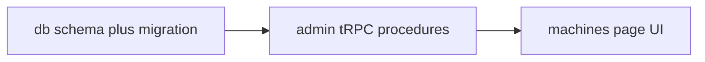

# Execution plan: Machines admin (`machines-admin`)

## 1. Thinking

### Invisible knowledge (context for implementers)

- **Auth:** All procedures use `adminProcedure` from [`apps/server/src/trpc/procedures.ts`](apps/server/src/trpc/procedures.ts) (or equivalent). Frontend is already behind `_admin` [`beforeLoad`](apps/admin-frontend/src/routes/_admin/route.tsx) (admin role). Do not expose these procedures on `publicProcedure`.
- **DB package:** Schema lives under [`packages/db/src/schema/`](packages/db/src/schema/). Only [`auth.ts`](packages/db/src/schema/auth.ts) exists today; add a new module and re-export from [`packages/db/src/schema/index.ts`](packages/db/src/schema/index.ts). Connection: `db` from [`packages/db/src/connection.ts`](packages/db/src/connection.ts). Migrations: [`packages/db/drizzle.config.ts`](packages/db/drizzle.config.ts) → `out: ./src/migrations`; use `pnpm`/`npm` from repo root per monorepo scripts (`db:generate`, `db:migrate`).
- **ID style:** Existing tables use **text** primary keys (Better Auth). Use **text** PKs for `machine_version` and `machine` (e.g. `crypto.randomUUID()` in Node) for consistency unless the team standardizes on `uuid` PG type elsewhere later.
- **Delete version:** Use FK `onDelete: "restrict"` (or default restrict) from `machine.machine_version_id` → `machine_version.id`. Map Postgres foreign-key violation in tRPC to `CONFLICT` or `BAD_REQUEST` with message like “This version is still assigned to one or more machines.”
- **Duplicate version number:** Unique index on `version_number`. Map unique violation to `CONFLICT` with message “Version number already exists.”
- **Edit version text:** `machineVersion.update` changes **description** only (machines reference `machine_version.id`, so edits are safe and immediately visible in lists/dropdowns).
- **Router registration:** Add nested keys under `adminRouter` in [`apps/server/src/trpc/routers/admin.ts`](apps/server/src/trpc/routers/admin.ts). Ensure [`apps/server/src/trpc/router.ts`](apps/server/src/trpc/router.ts) still merges `admin` unchanged.
- **Client types:** Admin app uses tRPC client from [`apps/admin-frontend/src/utils/trpc.ts`](apps/admin-frontend/src/utils/trpc.ts); after server changes, types flow from `AppRouter` — no manual duplication.
- **UI imports:** Prefer existing `@slushomat/ui` components (Button, Dialog, Table, Input, Label, Select, etc.) and patterns from other admin routes.

### Layer breakdown

1. **Database** — New tables `machine_version`, `machine`; migration generated and applied to dev DB.
2. **API** — Admin tRPC: list/create/**update**/delete versions; list/create/update/delete machines. Zod input/output on each procedure.
3. **Frontend** — Replace placeholder [`machines.tsx`](apps/admin-frontend/src/routes/_admin/machines.tsx) with two-section UI per `01-ui-spec.md`; React Query invalidation after mutations.

### Dependency order



### Tests

Skipped. See `02-test-spec.md`. Optional final **reviewer** pass only (no test-writer / mutation-tester tasks).

---

## 2. Execution order table

| Step | Task ID | Agent / role   | Depends on | Notes                          |
|------|---------|----------------|------------|--------------------------------|
| 1    | T01     | db-agent       | —          | Schema + migration             |
| 2    | T02     | api-agent      | T01        | tRPC on `adminRouter`          |
| 3    | T03     | frontend-agent | T02        | `/machines` UI                 |
| 4    | T04     | reviewer-agent | T03        | Optional quality pass          |

---

## 3. Per-task definitions

### T01 — Schema and migration

```
Task ID: T01
Agent: db-agent
Layer: Database
Description:
  - Add packages/db/src/schema/machines.ts:
    - machine_version: id (text PK), version_number (text, not null, unique), description (text, not null),
      created_at (default now), updated_at (onUpdate now) optional
    - machine: id (text PK), machine_version_id (text FK -> machine_version.id, onDelete restrict),
      comments (text, not null, default '' or not null with validation at API),
      created_at, updated_at
  - Export relations if useful for Drizzle queries
  - Export from schema/index.ts
  - Run drizzle-kit generate; commit SQL under packages/db/src/migrations/
  - Apply migrate (or push) per team practice
Artifact: packages/db/src/schema/machines.ts, packages/db/src/schema/index.ts, new migration SQL
Commit message: feat(db): add machine_version and machine tables
Depends on: —
Risk: low
```

**Acceptance:** Tables exist; FK prevents deleting referenced version; `version_number` unique.

---

### T02 — Admin tRPC procedures

```
Task ID: T02
Agent: api-agent
Layer: API
Description:
  - Under adminRouter, add namespaces or flat names, e.g.:
    - machineVersion.list — returns id, versionNumber, description, createdAt (ordered by version_number or created_at)
    - machineVersion.create — input: versionNumber (trim, min 1), description (trim, min 1)
    - machineVersion.update — input: id, description (trim, min 1); NOT_FOUND if id missing
    - machineVersion.delete — input: id; handle FK violation -> TRPCError
    - machine.list — join or secondary query to include versionNumber for display
    - machine.create — input: machineVersionId, comments (string)
    - machine.update — input: id, machineVersionId, comments
    - machine.delete — input: id
  - Use Zod .input/.output for all; map DB errors to TRPCError codes
  - Import db + tables from @slushomat/db
Artifact: apps/server/src/trpc/routers/admin.ts
Commit message: feat(api): admin machine version and machine CRUD
Depends on: T01
Risk: low
```

**Acceptance:** Matches AC-1, AC-1b, AC-2–AC-6; clear errors for duplicate version and protected version delete.

---

### T03 — Machines page UI

```
Task ID: T03
Agent: frontend-agent
Layer: Frontend
Description:
  - Implement machines.tsx per 01-ui-spec.md
  - trpc.machineVersion.list.useQuery + machine.list.useQuery
  - Mutations with onSuccess invalidate relevant queries
  - Dialogs for add version, **edit version** (description only), add/edit machine; confirm for deletes
  - Empty states when no versions
Artifact: apps/admin-frontend/src/routes/_admin/machines.tsx (+ small local components only if needed)
Commit message: feat(admin): machines page with versions and machines
Depends on: T02
Risk: low
```

**Acceptance:** AC-7; usable without reading API docs.

---

### T04 — Review (optional)

```
Task ID: T04
Agent: reviewer-agent
Layer: Review
Description: Security (admin-only), error handling, UX consistency, no leaked internals in error messages.
Artifact: PR comment or short review note
Depends on: T03
Risk: low
```

---

## 4. Workflow note

The Cursor command `npx tsx src/scripts/workflows/plan.ts` is **not present** in this repository; this file was authored manually. Preconditions: `00-requirements.md` and `02-test-spec.md` exist under `.cursor/tickets/machines-admin/`. **Branch:** create a feature branch before implementation (currently `main` is not ideal per workflow).
