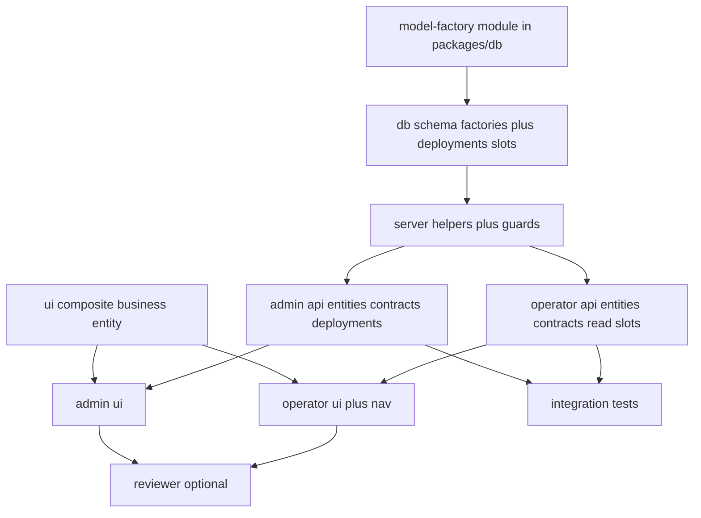

# Execution plan: Operator machine lifecycle (`operator-machine-lifecycle`)

## 0. Workflow preflight

| Check | Status / action |
|--------|----------------|
| `00-requirements.md` | Present |
| `01-ui-spec.md` | Present |
| `02-test-spec.md` | Present |
| `npx tsx src/scripts/workflows/plan.ts` | **Not in repo** — plan authored manually (same as `operator-products`, `machines-admin`) |
| Git branch | **Use a feature branch** (not `main`) before implementation |
| Depends on | `operator_product` table + operator org resolution patterns (see `operator-products` plan) |

### Human checkpoint 1 (before DB migrate / prod)

- **Backup database.** New tables: `business_entity`, versioned `operator_contract` (+ versions + changes), `machine_deployment`, `machine_slot_config`, `machine_slot` enum.
- Confirm **`operator_product`** exists in target DB (slot FK). If this branch lands before operator-products DB work, use a **two-phase migration** (slot column nullable, FK added in follow-up) — prefer **single branch** that includes both if timelines allow.

### Human checkpoint 2 (before merge)

- **Admin:** CRUD business entities (with org picker), create/edit contract (basis points + PDF upload), activate/terminate, start/end deployment; verify **second active contract** same machine is rejected.
- **Operator:** CRUD entities under `$orgSlug`, **read-only** contracts (incl. terminated), slot editor only with **open deployment**; cross-org access **blocked**.
- **PDF:** same signed-URL + confirm flow as template/product images; operator read/download only.

---

## 1. Thinking

### 1.1 Invisible knowledge (read before coding)

**Org context (operator app)**  
[`apps/operator-frontend/src/routes/_protected/$orgSlug/route.tsx`](apps/operator-frontend/src/routes/_protected/$orgSlug/route.tsx) aligns URL slug with session active org. Pass **`orgSlug`** on operator tRPC inputs; server resolves `organization.id` and **`assertUserMemberOfOrg(userId, organizationId)`** — do not trust client `organizationId` alone.

**`operatorProcedure` today**  
[`apps/server/src/trpc/procedures.ts`](apps/server/src/trpc/procedures.ts): admins bypass membership check; non-admins only need **any** member row. **All new operator routes for this feature must** resolve org from `orgSlug` and **require a `member` row for that org** (same recommendation as `operator-products` plan).

**Admin vs operator routers**  
- **Contracts, deployments:** `adminProcedure` only.  
- **Business entities:** both admin (any org, pass `organizationId` or org slug from picker) and operator (`orgSlug` from route).  
- **Slots:** operator writes; admin override **out of scope** v1.

**Model-factory (required — inside `packages/db`)**  
Do **not** hand-roll versioned/static triples ad hoc. **Add the factory under the database package:** **`packages/db/src/model-factory/`** (e.g. `index.ts` + factory modules), by **copying/porting** the Database Agent skill **`model-factory`**: `~/.cursor/plugins/agent-stack/src/skills/database/model-factory.md` — `defineStaticEntity`, `defineVersionedEntity`, system columns, scopes (`org` \| `user` \| `org-user` \| `app`), runtime **`StaticTable` / `VersionedTable`**, `Session`, `SYSTEM_KEYS`, `Transact` DI.

- **No separate workspace package** — stays colocated with Drizzle schema in **`@slushomat/db`**. Expose via **`@slushomat/db/model-factory`** (add explicit `exports` entry in [`packages/db/package.json`](../../../packages/db/package.json) pointing at `./src/model-factory/index.ts`) and/or relative imports from `packages/db/src/schema/*`.
- **Naming:** Skill examples use `organisationId` — map to this repo’s **`organizationId` / `organization_id`** and existing `organization` FKs in [`packages/db/src/schema/auth.ts`](../../../packages/db/src/schema/auth.ts).
- **`business_entity`:** `defineStaticEntity({ name: "business_entity", scope: "org", softDelete: true, columns: … })` with legal/address fields from requirements.
- **`operator_contract`:** `defineVersionedEntity` — **`baseColumns` (immutable):** `businessEntityId`, `machineId` (FKs); **`versionColumns`:** `status`, `effectiveDate`, `endedAt`, `monthlyRentInCents`, `revenueShareBasisPoints`, PDF storage fields, `notes`; scope **`org`** so **`organizationId`** is injected on the base per skill.
- **`machine_slot` enum, `machine_deployment`, `machine_slot_config`:** **plain Drizzle** in `packages/db`, referencing factory-generated tables.
- **Services:** extend `StaticTable` / `VersionedTable` where helpful; wire **`Transact`** to [`packages/db/src/transaction.ts`](../../../packages/db/src/transaction.ts) per skill.

**`business_entity.organizationId`**  
Must match the **organization** on every contract that references the entity. Admin contract create: validate `businessEntity.organizationId === input.organizationId`.

**Machine**  
Global rows from [`packages/db/src/schema/machines.ts`](packages/db/src/schema/machines.ts). Admin picks `machineId` from existing admin list/query pattern.

**At most one active contract per machine**  
Status lives on **version** rows; “current” is base.`currentVersionId`. **Enforce in a transaction** when transitioning to `active`: no other `operator_contract` with same `machineId` may have current version `status === 'active'`. Machines with **zero** active contracts are valid.

**Deployments**  
Partial unique: at most one row per `machineId` with `endedAt IS NULL`. Starting a deployment ends any prior open row for that machine (same transaction).

**Slots**  
Postgres enum `machine_slot`: `left`, `middle`, `right`. `machine_slot_config` rows keyed by `machineDeploymentId` + slot; FK to `operator_product.id`; **nullable** `operatorProductId` to clear. **Upsert** three rows on save or insert-on-first-edit — pick one pattern in API.

**Revenue share**  
Persist **`revenueShareBasisPoints`** 0–10000. UI: display as percent with 0.01% resolution (or 0.1% if product prefers rounding); validate server-side.

**Contract PDF**  
Mirror [`apps/server/src/trpc/routers/admin-template-products.ts`](apps/server/src/trpc/routers/admin-template-products.ts) (or shared product image flow): bucket + object path stored on version (or dedicated column); `requestUpload` + `confirm` + signed URLs; **application/pdf** or same allowlist as product owner decides — document MIME in Zod.

**Operator contract read scope**  
Return contracts where `operator_contract.organizationId` matches resolved org **and** (optional) `machineId` filter. Operators see **draft | active | terminated**; include version history if cheap (join versions ordered by `versionNumber`), else current version + “history” endpoint later.

---

### 1.2 Layer breakdown

1. **Model-factory module (T00)** — `packages/db/src/model-factory/` ported from db-agent skill; exported from `@slushomat/db` (subpath or barrel).  
2. **Database (T01)** — factory-defined `business_entity` + `operator_contract` (base/versions/changes) + plain Drizzle `machine_slot` enum + `machine_deployment` + `machine_slot_config`; indexes + FKs.  
3. **Server helpers** — org by slug, member assert, entity-in-org assert, current deployment lookup, active-contract guard.  
4. **API** — `admin.*` routers (entities, contracts, deployments) + `operator.*` (entities, contracts read, slots).  
5. **UI package** — composite `business-entity-form` (+ optional list row).  
6. **Admin frontend** — org picker + entities + contracts + deployments screens.  
7. **Operator frontend** — `$orgSlug` routes: entities, contracts (read), fleet/slots.  
8. **Tests** — integration tests per `02-test-spec.md` (I-1–I-10) if team capacity; else defer with explicit TODO.

---

### 1.3 Migration strategy (DB)

**Prerequisite:** **T00** — `packages/db/src/model-factory/` exists and is importable from schema code (and optionally `@slushomat/db/model-factory`).

1. **`defineStaticEntity` → `business_entity`** — org scope, soft delete; columns per `00-requirements.md`.  
2. **`defineVersionedEntity` → `operator_contract`** — base: `businessEntityId`, `machineId`; versions: status, dates, rent, `revenueShareBasisPoints`, PDF columns, notes; changes table per factory.  
3. **Plain Drizzle:** `machine_slot` enum (`left`, `middle`, `right`).  
4. **`machine_deployment`** — partial unique on `machine_id` WHERE `ended_at IS NULL`.  
5. **`machine_slot_config`** — unique `(machine_deployment_id, slot)`; nullable `operator_product_id` FK.  
6. Export from [`packages/db/src/schema/index.ts`](../../../packages/db/src/schema/index.ts); merge factory `*Relations` with manual relations for deployments/slots.

Apply via team’s usual `drizzle-kit generate` / migrate workflow.

---

### 1.4 Dependency order



**Parallelism:** After **T00**, **T05** can start with mocked props. **T01** requires **T00**. **T03** and **T04** can split by developer after **T02**.

---

## 2. Execution order table

| Step | Task ID | Agent | Depends on | Notes |
|------|---------|--------|------------|-------|
| 0 | T00 | db-agent | — | Add `packages/db/src/model-factory/` from db-agent skill |
| 1 | T01 | db-agent | T00 | Factories + migration (deployments/slots plain Drizzle) |
| 2 | T02 | api-agent | T01 | Org/entity/deployment helpers |
| 3 | T03 | api-agent | T02 | Admin tRPC |
| 4 | T04 | api-agent | T02 | Operator tRPC |
| 5 | T05 | frontend-agent | — | *Parallel T00/T01; mocked props OK |
| 6 | T06 | frontend-agent | T03, T05 | Admin UI |
| 7 | T07 | frontend-agent | T04, T05 | Operator UI |
| 8 | T08 | test-writer-agent | T03, T04 | Optional if time |
| 9 | T09 | reviewer-agent | T06, T07 | Optional |

---

## 3. Per-task definitions

### T00 — Module: `packages/db/src/model-factory` (port from db-agent skill)

```
Task ID: T00
Agent: db-agent
Layer: packages/db (model-factory subfolder only)
Description:
  - Create packages/db/src/model-factory/ (index barrel + implementation files).
  - Port defineStaticEntity, defineVersionedEntity, StaticTable, VersionedTable, Session, SYSTEM_KEYS, OmitSystemKeys from skill:
    ~/.cursor/plugins/agent-stack/src/skills/database/model-factory.md
  - Drizzle pg-core factories output base + versions + changes; org scope injects organizationId (not organisationId).
  - packages/db/package.json: add exports entry "./model-factory" -> ./src/model-factory/index.ts (and/or re-export from src/index.ts) so apps can import @slushomat/db/model-factory.
  - Model-factory code must NOT import from packages/db/schema (avoid cycles); only drizzle-orm + pg-core. Schema in T01 imports model-factory.
Artifact: packages/db/src/model-factory/**, packages/db/package.json exports
Commit message: feat(db): model-factory utilities under packages/db
Depends on: —
Risk: medium (export wiring + cycle avoidance)
```

---

### T01 — Schema: entities, versioned contracts, deployments, slots

```
Task ID: T01
Agent: db-agent
Layer: Database
Description:
  - Depends on T00. Import from ../model-factory or @slushomat/db/model-factory in packages/db schema modules.
  - business_entity: defineStaticEntity org scope, softDelete, legal/address columns per 00-requirements.
  - operator_contract: defineVersionedEntity; baseColumns businessEntityId, machineId; versionColumns status, dates, monthlyRentInCents, revenueShareBasisPoints, PDF fields, notes; changes table from factory.
  - Plain Drizzle: machine_slot enum (left, middle, right); machine_deployment; machine_slot_config with FK operator_product.
  - Partial unique open deployment per machine; indexes for admin filters.
Artifact: packages/db/src/schema/*.ts, migrations
Commit message: feat(db): operator machine lifecycle tables
Depends on: T00
Risk: medium (new FKs; coordinate with operator_product)
```

---

### T02 — Server helpers

```
Task ID: T02
Agent: api-agent
Layer: API / lib
Description:
  - Reuse or add getOrganizationIdForSlug + assertUserMemberOfOrg (operator-products).
  - assertBusinessEntityBelongsToOrg(entityId, organizationId).
  - getOpenDeploymentForMachine(machineId) -> row | null.
  - assertAtMostOneActiveContractForMachine(tx, machineId, excludeContractBaseId?) when activating.
  - Optional: small types for ContractStatus, MachineSlot shared server/client.
Artifact: apps/server/src/lib/org-scope.ts or similar
Commit message: feat(api): machine lifecycle guards and org helpers
Depends on: T01
Risk: medium
```

---

### T03 — tRPC admin: entities, contracts, deployments

```
Task ID: T03
Agent: api-agent
Layer: API
Description:
  - admin.businessEntity: listByOrganization, create, update, softDelete (inputs include target organizationId).
  - admin.operatorContract: list (filters), get by id, create (base + v1), updateVersion (new version row), requestPdfUpload, confirmPdf, transitionStatus (activate/terminate with guards).
  - admin.machineDeployment: start (end prior open), end (set ended_at).
  - All adminProcedure; validate FK consistency (entity org matches contract org, machine exists).
  - Use services + tx per repo conventions; no direct db in procedures if project uses services.
Artifact: new routers under apps/server/src/trpc/routers/, root merge
Commit message: feat(api): admin machine lifecycle procedures
Depends on: T02
Risk: high
```

---

### T04 — tRPC operator: entities, contracts read, slots

```
Task ID: T04
Agent: api-agent
Layer: API
Description:
  - operator.businessEntity: list, create, update, softDelete — all scoped by orgSlug + member check.
  - operator.operatorContract: list (org; optional machineId), get — read-only; include terminated; no mutations.
  - operator.machineSlot: getConfigForMachine(orgSlug, machineId) resolving open deployment + three slots; setSlots (orgSlug, machineId, { left?, middle?, right? product ids }) — assert deployment open, products belong to org.
Artifact: operator router extensions
Commit message: feat(api): operator machine lifecycle read and slots
Depends on: T02
Risk: high (auth boundaries)
```

---

### T05 — UI: composite business entity

```
Task ID: T05
Agent: frontend-agent
Layer: Design system
Description:
  - packages/ui composite: business-entity-form (fields from 01-ui-spec), optional list row.
  - No tRPC inside; props/callbacks only.
Artifact: packages/ui/src/composite/business-entity-*.tsx
Commit message: feat(ui): business entity composite
Depends on: — (parallel T01)
Risk: low
```

---

### T06 — Admin UI

```
Task ID: T06
Agent: frontend-agent
Layer: Admin UI
Description:
  - Navigation entries for lifecycle (exact labels: Businesses / Contracts / Deployments or grouped under Fleet — pick one).
  - Org picker reusing admin-create-customer or organizations list pattern.
  - Screens: business entities CRUD, contracts list + create/edit + PDF + status actions, deployments start/end.
  - Wire admin.businessEntity.*, admin.operatorContract.*, admin.machineDeployment.*
Artifact: apps/admin-frontend/src/routes/_admin/*.tsx
Commit message: feat(admin): machine lifecycle management UI
Depends on: T03, T05
Risk: medium
```

---

### T07 — Operator UI

```
Task ID: T07
Agent: frontend-agent
Layer: Operator UI
Description:
  - Routes under $orgSlug: businesses (entities), contracts (read-only list/detail), machines/fleet + slot editor (product picker from existing operator product list API).
  - Empty/error states per 01-ui-spec (no deployment, no contract OK).
  - Nav links from operator shell.
Artifact: apps/operator-frontend/src/routes/_protected/$orgSlug/*.tsx
Commit message: feat(operator): machine lifecycle and slots UI
Depends on: T04, T05
Risk: medium
```

---

### T08 — Integration tests

```
Task ID: T08
Agent: test-writer-agent
Layer: Testing
Description:
  - Cover I-1 through I-10 from 02-test-spec.md (PGlite pattern per repo).
  - Skip or shrink if time-boxed; document gaps.
Depends on: T03, T04
Risk: low
```

---

### T09 — Review (optional)

```
Task ID: T09
Agent: reviewer-agent
Layer: Review
Description: Security (org isolation, admin-only mutations), PDF flow, basis points validation, deployment invariants.
Depends on: T06, T07
Risk: low
```

---

## 4. Subagent cheat sheet

| Agent | Use for |
|--------|---------|
| **db-agent** | T00, T01 |
| **api-agent** | T02, T03, T04 |
| **frontend-agent** | T05, T06, T07 |
| **test-writer-agent** | T08 |
| **reviewer-agent** | T09 |

---

## 5. Tickets

Comprehensive tickets **`T00.md`–`T09.md`** live under [`.cursor/tickets/operator-machine-lifecycle/tickets/`](./tickets/). **T00** = `packages/db/src/model-factory/`; **T01** depends on **T00**.

---

## 6. Done criteria

- [ ] **`packages/db/src/model-factory/`** exists; schema uses `defineStaticEntity` / `defineVersionedEntity` for this feature.
- [ ] DB: all new tables + enum + indexes; slot FK to `operator_product`.
- [ ] Admin: full CRUD entities (any org), contracts + PDF + status, deployments.
- [ ] Operator: entities CRUD, contracts read-only (all statuses), slots only with open deployment.
- [ ] No cross-org data leakage on operator routes.
- [ ] At most one active contract per machine when any active exists.
- [ ] Basis points 0–10000 stored and validated; UI shows human-readable %.
- [ ] Integration tests (if T08 executed) green; else manual QA from §0 checkpoint 2.

---

## 7. Workflow note

The Cursor command `npx tsx src/scripts/workflows/plan.ts --step 1 --feature operator-machine-lifecycle` is **not available** in this repository. Human checkpoints in **§0** replace scripted steps 4/7 from the generic `/plan` command.

**Branch:** Create `feat/operator-machine-lifecycle` (or similar) from `main` before implementation — preflight currently on `main`.
