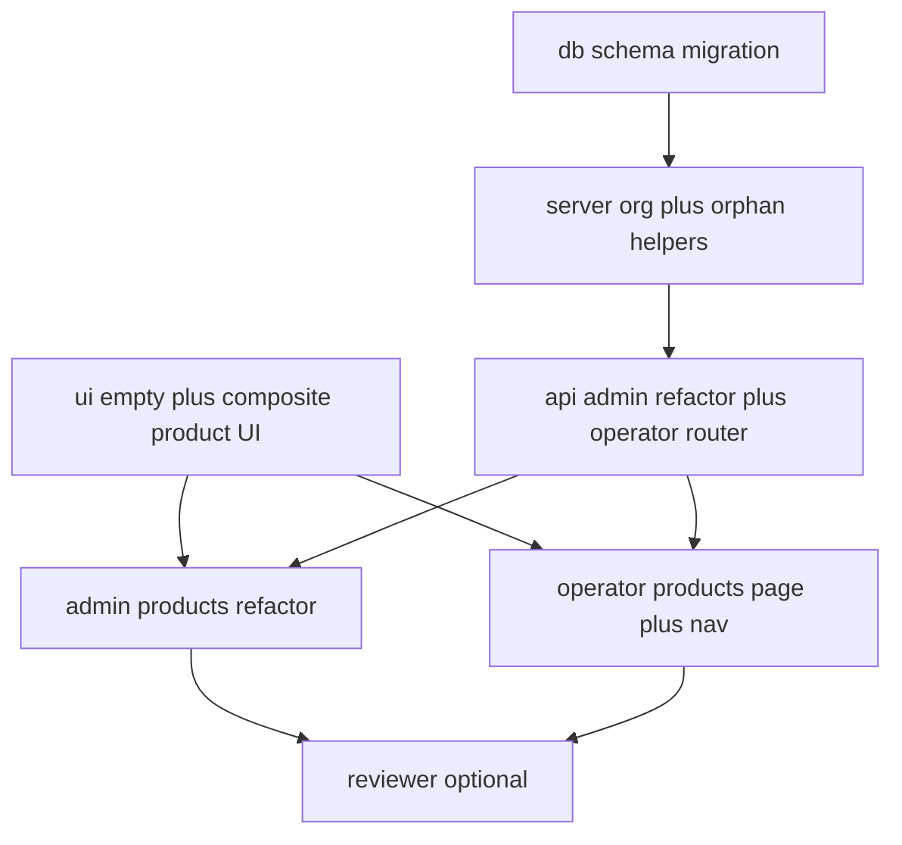

# Execution plan: Operator products + shared `product_image` (`operator-products`)

## 0. Workflow preflight

| Check | Status / action |
|--------|------------------|
| `00-requirements.md` | Present |
| `02-test-spec.md` | Present (**tests skipped** — manual QA only) |
| `npx tsx src/scripts/workflows/plan.ts` | **Not in repo** — plan authored manually (same as `machines-admin`, `admin-template-products`) |
| Git branch | **Use a feature branch** (not `main`) before implementation |
| `01-ui-spec.md` | Present — UI flows + shadcn **Empty** + composite |

### Human checkpoint 1 (before DB migrate on shared / prod)

- **Backup database.** This feature restructures how template images are stored (`template_product_image` → `product_image` + FK on `template_product`).
- Confirm whether **any** `template_product.organization_id` is non-null in production. If yes, migrate those rows into `operator_product` **before** dropping the column (see §1.3).

### Human checkpoint 2 (before merge)

- Smoke-test **admin** template products (list, create, edit, image upload, delete) and **operator** products (list, empty state, create, copy from template, edit, delete).
- Verify Storage: deleting an operator product that **shares** an image with a template does **not** remove the object until nothing references the `product_image` row.

---

## 1. Thinking

### 1.1 Invisible knowledge (read before coding)

**Org context (operator app is already aligned)**  
[`apps/operator-frontend/src/routes/_protected/$orgSlug/route.tsx`](apps/operator-frontend/src/routes/_protected/$orgSlug/route.tsx) enforces `params.orgSlug === session.activeOrganizationSlug`. So the **URL slug and “active org” in session already match** when the user is on org routes. For tRPC, pass **`orgSlug`** (from route) on each call; server resolves `organization.id` via [`organization.slug`](packages/db/src/schema/auth.ts) and verifies the user is in [`member`](packages/db/src/schema/auth.ts) for that org. **Do not** trust `organizationId` alone from the client without slug+membership (or without verifying id matches slug).

**`operatorProcedure` gap**  
Today [`operatorProcedure`](apps/server/src/trpc/procedures.ts) only checks **any** `member` row for the user — not **which** org. New procedures must **add** an explicit check: `member.userId = ctx.user.id` AND `member.organizationId = resolvedOrgId`. Admins (`role === admin"`) may bypass org membership for operator routes **only if** product owner wants — requirements default is operator-only; simplest is **admins use admin router** for templates and **operator router** requires membership even for admins when testing, **or** admins skip org check only when `isAdmin` — pick one and document. **Recommendation:** operator `product.*` procedures **always** require `member` for the resolved org (admins test via operator UI while impersonating / in org context).

**Data model end state** (from `00-requirements.md`)

| Table | Role |
|-------|------|
| `product_image` | `id`, `bucket`, `object_path`, timestamps — **no** product FKs on this table |
| `template_product` | Global templates; **`product_image_id`** nullable → `product_image`; **remove** `organization_id` once no longer needed (globals only) |
| `operator_product` | `organization_id` → `organization`; same price/tax/name fields; `product_image_id` nullable; `source_template_product_id` nullable → `template_product` |
| ~~`template_product_image`~~ | **Dropped** after migration |

**Copy from template**  
Single transaction (or ordered steps): `INSERT operator_product` with copied scalar fields, `product_image_id = template.product_image_id`, `source_template_product_id = template.id`. **No** Storage upload, **no** new `product_image` row.

**Image delete / orphan Storage**  
When removing an image association or deleting a product:

1. Clear or delete product row’s `product_image_id` as appropriate.
2. If a `product_image` row is **no longer referenced** by any `template_product` or `operator_product`, **then** `removeObject` in Storage and delete `product_image` row. Implement a small **`countReferences(productImageId)`** or two existence queries in the admin/operator routers or a shared `@slushomat/db` helper.

**Admin router refactor**  
[`admin-template-products.ts`](apps/server/src/trpc/routers/admin-template-products.ts) currently uses `templateProductImage` join. After migration:

- List/join: `template_product` **leftJoin** `product_image` on `template_product.product_image_id = product_image.id` (or two-step select).
- `requestImageUpload` / `confirm`: create or update **`product_image`** row and set **`template_product.product_image_id`** (replace old ref + orphan cleanup if needed).
- Path prefix logic can stay under `template-products/{templateProductId}/…` or move under a neutral prefix — **keep stable** unless you want one migration for Storage paths (out of scope unless required).

**Constants**  
Reuse `TEMPLATE_PRODUCT_IMAGE_MAX_BYTES`, JPEG/PNG allowlist, and Zod patterns from admin router — extract to `@slushomat/db` or `apps/server/src/lib/product-image.ts` if duplication hurts.

**tRPC shape**  
- `operator.product` (or `operator.operatorProduct`) namespace: `list`, `create`, `update`, `delete`, `copyFromTemplate`, `requestImageUpload`, `confirmProductImage`, optional `listTemplates` (global templates for picker — read-only, **no** org filter on templates, but **membership** required to call).  
- Input on mutating routes: **`orgSlug`** string (min 1) on every procedure that is org-scoped.

**Tests**  
Skipped per `02-test-spec.md`. Optional **reviewer-agent** pass at end.

**UI**  
- Add shadcn **Empty** to [`packages/ui`](packages/ui) (export from `package.json` `exports` like other base components).  
- Composite product form in [`packages/ui/src/composite/`](packages/ui/src/composite/) — props-driven (`value`, `onChange`, `onPickFile`, etc.) so admin and operator pass tRPC mutations.

---

### 1.2 Layer breakdown

1. **Database** — `product_image`, `operator_product`, migrate off `template_product_image`, alter `template_product`, optional drop `template_product.organization_id`.
2. **Server helpers** — resolve org by slug + assert member; orphan image cleanup.
3. **API** — Refactor `admin.templateProduct` + new `operator` product router; register on [`operatorRouter`](apps/server/src/trpc/routers/operator.ts).
4. **Design system** — shadcn Empty + composite product form/list primitives.
5. **Admin frontend** — Refactor [`products.tsx`](apps/admin-frontend/src/routes/_admin/products.tsx) to consume composite (+ fix imports if paths change).
6. **Operator frontend** — New `$orgSlug/products` route, nav link, Empty state, sheets/modals per `01-ui-spec.md`.

---

### 1.3 Migration strategy (DB) — detailed

**Step A — Create `product_image`**  
Empty table with PK + bucket + object_path + timestamps.

**Step B — Backfill from `template_product_image`**  
For each row in `template_product_image`:

- Insert into `product_image` (new id or reuse old id — **reusing** image row id simplifies FK updates) with same `bucket`, `object_path`, `created_at`.
- Set `template_product.product_image_id` = that `product_image.id`.

**Step C — Add `template_product.product_image_id`**  
Column nullable FK; run backfill SQL/script; then set NOT NULL if every template must have image — **optional** (templates can lack image).

**Step D — Drop `template_product_image`**  
After no code references it.

**Step E — `template_product.organization_id`**  
If column exists and all production rows are null: **drop column** + index. If any non-null: **migrate** those rows into `operator_product` first (same fields + `product_image_id` from join), then null out or drop column.

**Step F — Create `operator_product`**  
With indexes on `organization_id`, optional on `source_template_product_id`.

Apply via `drizzle-kit push` / generate per team practice. Prefer **one feature branch migration** with clear ordering in a single migration file if your process allows.

---

### 1.4 Dependency order



**Parallelism:** After **T01** completes, **T04** can start (UI against mocked props) while **T02→T03** runs; **T05/T06** need **T03** and **T04**.

---

## 2. Execution order table

| Step | Task ID | Agent | Depends on | Notes |
|------|---------|--------|------------|--------|
| 1 | T01 | db-agent | — | Schema + migration + data backfill plan |
| 2 | T02 | api-agent or generalPurpose | T01 | Org resolve + member assert + orphan image helper |
| 3 | T03 | api-agent | T02 | Admin refactor + `operator.product` router |
| 4 | T04 | frontend-agent | — * | Empty + composite (*start after T01 for types optional) |
| 5 | T05 | frontend-agent | T03, T04 | Admin `products.tsx` uses composite |
| 6 | T06 | frontend-agent | T03, T04 | Operator route + nav + flows |
| 7 | T07 | reviewer-agent | T05, T06 | Optional |

---

## 3. Per-task definitions

### T01 — Schema: `product_image`, `operator_product`, migrate templates

```
Task ID: T01
Agent: db-agent
Layer: Database
Description:
  - Add product_image table (text PK, bucket, object_path, created_at, updated_at optional).
  - Add operator_product table: organization_id FK organization, name, price_in_cents, tax_rate_percent,
    product_image_id FK product_image nullable, source_template_product_id FK template_product nullable,
    created_at, updated_at.
  - Add template_product.product_image_id FK product_image nullable.
  - Migrate data from template_product_image -> product_image + set template_product.product_image_id.
  - Drop template_product_image table from schema; generate migration / push.
  - Remove template_product.organization_id if requirements confirmed (or leave one more sprint if risky).
  - Export from packages/db/src/schema/index.ts; add relations if useful for Drizzle queries.
Artifact: packages/db/src/schema/*.ts, migrations or push log
Commit message: feat(db): product_image, operator_product, template product image FK
Depends on: —
Risk: high (data migration — test on copy of prod)
```

**Acceptance:** Admin app can be pointed at DB and old template images remain addressable via new FK model (verified after T03).

---

### T02 — Server helpers: org + membership + orphan image

```
Task ID: T02
Agent: api-agent (or generalPurpose)
Layer: API / lib
Description:
  - getOrganizationIdForSlug(slug): select organization.id by slug; NOT_FOUND if missing.
  - assertUserMemberOfOrg(db, userId, organizationId): FORBIDDEN if no member row.
  - Optional: build orgScopedProcedure(orgSlugInput) middleware that resolves orgId + asserts member and injects ctx.organizationId.
  - deleteProductImageIfUnreferenced(db, storage, productImageId): count references from template_product + operator_product; if zero, removeObject + delete row.
Artifact: apps/server/src/trpc/middleware or lib/org-scope.ts, or inline in router module
Commit message: feat(api): org slug resolution and product image orphan cleanup
Depends on: T01
Risk: medium
```

---

### T03 — tRPC: refactor admin template product + operator product API

```
Task ID: T03
Agent: api-agent
Layer: API
Description:
  - Refactor admin-template-products.ts to use product_image + template_product.product_image_id (remove templateProductImage table usage).
  - Implement operatorRouter.product (nested router): list(orgSlug), create, update, delete, copyFromTemplate(orgSlug, templateProductId),
    requestImageUpload(orgSlug, operatorProductId, ...), confirmProductImage(...), listTemplates(orgSlug) for picker (global templates only).
  - All operator routes: resolve org from orgSlug, assert member, scope queries to operator_product.organization_id.
  - copyFromTemplate: insert operator_product with shared product_image_id and source_template_product_id.
  - Reuse image validation constants (JPEG/PNG, 5MB fileSizeBytes) from admin.
  - Register on apps/server/src/trpc/routers/operator.ts
Artifact: admin-template-products.ts, new operator-products.ts (name flexible), operator.ts, procedures.ts if extended
Commit message: feat(api): operator products and shared product_image for templates
Depends on: T02
Risk: high (large refactor + security)
```

**Acceptance:** FR-2–FR-5 and security boundaries from `00-requirements.md`.

---

### T04 — UI package: shadcn Empty + composite product form

```
Task ID: T04
Agent: frontend-agent
Layer: Design system
Description:
  - Run shadcn add empty (or manual port) into packages/ui; export from packages/ui/package.json exports (./base/empty or composite).
  - Add composite/product-form.tsx (or split fields): name, price euros string, tax select, image dropzone — props only, no tRPC inside.
  - Optional composite/product-list-row.tsx for thumbnail + labels.
  - Match admin styling (text-xs, borders) from existing products page.
Artifact: packages/ui/src/base/empty.tsx (or path shadcn chooses), packages/ui/src/composite/product-*.tsx
Commit message: feat(ui): empty state and composite product form
Depends on: — (parallel T01)
Risk: low
```

---

### T05 — Admin frontend: adopt composite

```
Task ID: T05
Agent: frontend-agent
Layer: Admin UI
Description:
  - Refactor apps/admin-frontend/src/routes/_admin/products.tsx to use composite form + any shared list bits.
  - Wire trpc.admin.templateProduct.* unchanged from caller POV if procedure names stable; adjust if renamed.
  - Regression: list, CRUD, image upload, delete, shared image behavior N/A on admin.
Artifact: apps/admin-frontend/src/routes/_admin/products.tsx
Commit message: refactor(admin): template products use composite UI
Depends on: T03, T04
Risk: medium
```

---

### T06 — Operator frontend: Products page

```
Task ID: T06
Agent: frontend-agent
Layer: Operator UI
Description:
  - Add routes/_protected/$orgSlug/products.tsx; run vite build to refresh route tree.
  - Nav: add Products link in operator shell (sidebar or dashboard — mirror admin pattern).
  - List with trpc.operator.product.list({ orgSlug: params.orgSlug }) from route.
  - Empty: shadcn Empty + Create product + Add from template buttons.
  - Sheets: create/edit using composite form; copy-from-template modal listing listTemplates.
  - Image upload: same Supabase signed flow as admin but operator mutations + operatorProductId.
  - Breadcrumbs if operator uses them.
Artifact: apps/operator-frontend/src/routes/_protected/$orgSlug/products.tsx, nav component updates, routeTree.gen.ts
Commit message: feat(operator): org products page with template copy
Depends on: T03, T04
Risk: medium
```

---

### T07 — Review (optional)

```
Task ID: T07
Agent: reviewer-agent
Layer: Review
Description: Cross-check org isolation, shared image delete safety, admin regression, a11y on Empty + forms.
Depends on: T05, T06
Risk: low
```

---

## 4. Subagent cheat sheet

| Agent | Use for |
|--------|---------|
| **db-agent** | T01 migrations |
| **api-agent** | T02, T03 |
| **frontend-agent** | T04, T05, T06 |
| **reviewer-agent** | T07 |

---

## 5. Ticket writer (next step)

After you approve this plan, run **ticket-writer-agent** with this `03-plan.md` to emit `tickets/T01.md` … under `.cursor/tickets/operator-products/tickets/`.

---

## 6. Done criteria

- [ ] `product_image` + `operator_product` live; `template_product` uses `product_image_id`; `template_product_image` removed.
- [ ] Operator `/products` under `$orgSlug` with **Empty** + create + copy from template.
- [ ] Admin template products still work end-to-end.
- [ ] Shared image: copy template → operator reuses same `product_image` row; delete rules respect references.
- [ ] No automated tests required; manual QA complete.

---

## 7. Workflow note

The Cursor command `npx tsx src/scripts/workflows/plan.ts --step 1 --feature operator-products` is **not available** in this repository. Human checkpoints §0 replace scripted steps 4/7 from the generic `/plan` command where applicable.
